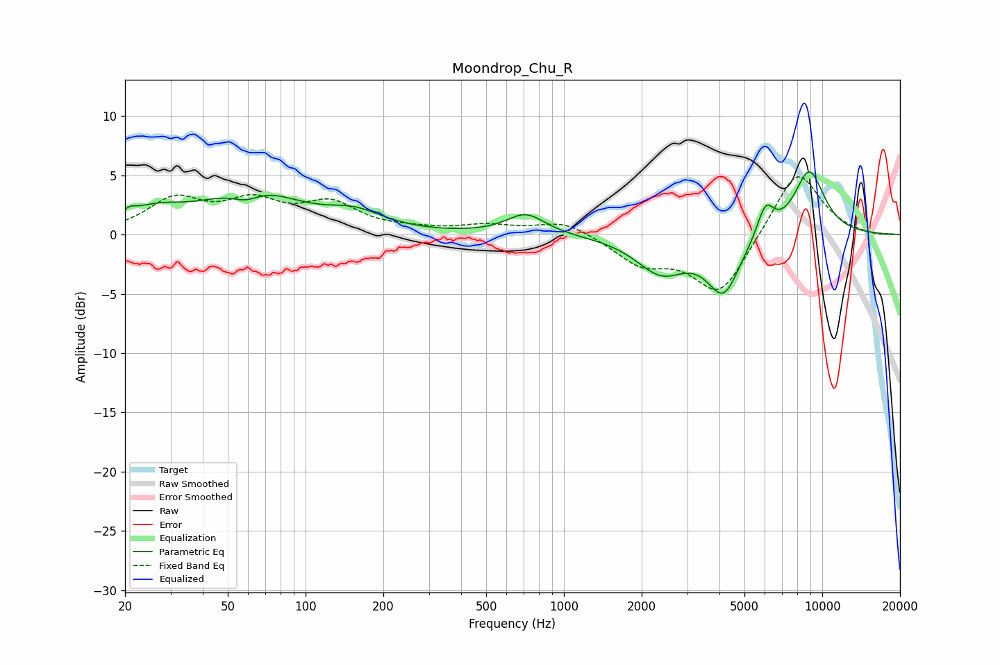

# Moondrop_Chu_R
See [usage instructions](https://github.com/jaakkopasanen/AutoEq#usage) for more options and info.

### Parametric EQs
Apply preamp of -5.4 dB when using parametric equalizer.

|   # | Type    |   Fc (Hz) |    Q |   Gain (dB) |
|-----|---------|-----------|------|-------------|
|   1 | Peaking |        21 | 5.75 |         0.5 |
|   2 | Peaking |        26 | 1.23 |         1.5 |
|   3 | Peaking |        59 | 2.5  |        -1.1 |
|   4 | Peaking |        62 | 0.8  |         3.6 |
|   5 | Peaking |       156 | 1.29 |         1.4 |
|   6 | Peaking |       712 | 1.9  |         1.8 |
|   7 | Peaking |      2383 | 1.44 |        -3   |
|   8 | Peaking |      4151 | 2.21 |        -4.7 |
|   9 | Peaking |      6031 | 4.14 |         2.6 |
|  10 | Peaking |      8904 | 2.1  |         5.5 |

### Fixed Band EQs
When using fixed band (also called graphic) equalizer, apply preamp of **-5.0 dB** (if available) and set gains manually with these parameters.

|   # | Type    |   Fc (Hz) |    Q |   Gain (dB) |
|-----|---------|-----------|------|-------------|
|   1 | Peaking |        31 | 1.41 |         2.8 |
|   2 | Peaking |        62 | 1.41 |         2.4 |
|   3 | Peaking |       125 | 1.41 |         2.4 |
|   4 | Peaking |       250 | 1.41 |         0.3 |
|   5 | Peaking |       500 | 1.41 |         0.7 |
|   6 | Peaking |      1000 | 1.41 |         1.2 |
|   7 | Peaking |      2000 | 1.41 |        -2.3 |
|   8 | Peaking |      4000 | 1.41 |        -5.1 |
|   9 | Peaking |      8000 | 1.41 |         5.7 |
|  10 | Peaking |     16000 | 1.41 |        -0.1 |

### Graphs

