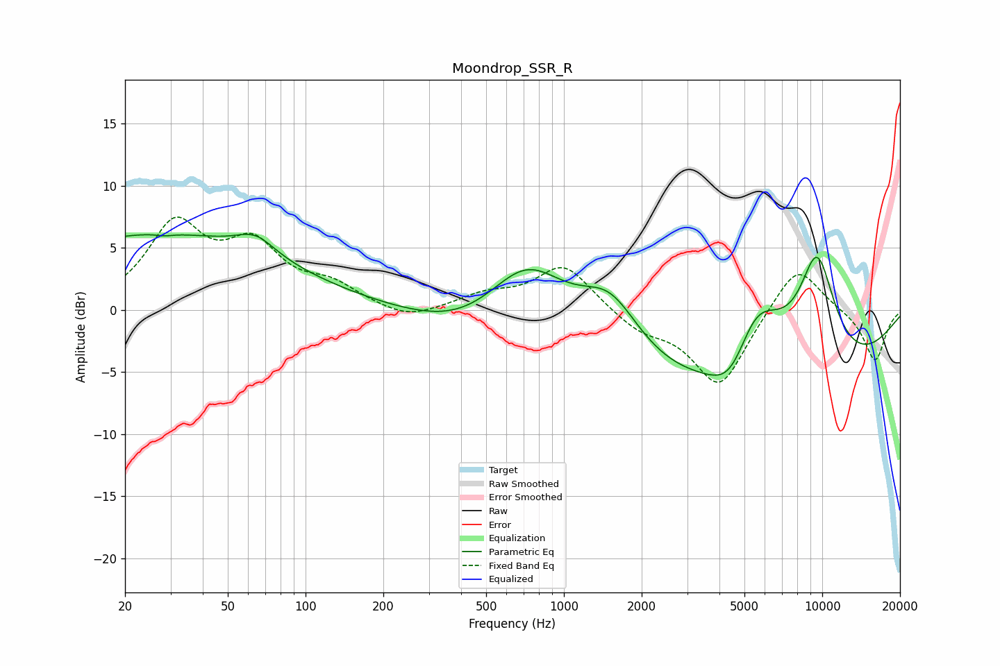

# Moondrop_SSR_R
See [usage instructions](https://github.com/jaakkopasanen/AutoEq#usage) for more options and info.

### Parametric EQs
Apply preamp of -6.2 dB when using parametric equalizer.

|   # | Type    |   Fc (Hz) |    Q |   Gain (dB) |
|-----|---------|-----------|------|-------------|
|   1 | Peaking |        26 | 0.28 |         6   |
|   2 | Peaking |        28 | 4.81 |        -0.2 |
|   3 | Peaking |        64 | 1.89 |         1.5 |
|   4 | Peaking |       435 | 0.64 |        -2.2 |
|   5 | Peaking |       719 | 0.87 |         6.2 |
|   6 | Peaking |      1512 | 1.16 |         4.9 |
|   7 | Peaking |      4481 | 1.63 |        -3.9 |
|   8 | Peaking |      4953 | 0.2  |        -7.7 |
|   9 | Peaking |      5464 | 1.22 |         7.4 |
|  10 | Peaking |      9543 | 1.62 |         9.5 |

### Fixed Band EQs
When using fixed band (also called graphic) equalizer, apply preamp of **-7.6 dB** (if available) and set gains manually with these parameters.

|   # | Type    |   Fc (Hz) |    Q |   Gain (dB) |
|-----|---------|-----------|------|-------------|
|   1 | Peaking |        31 | 1.41 |         6.5 |
|   2 | Peaking |        62 | 1.41 |         4.6 |
|   3 | Peaking |       125 | 1.41 |         1.6 |
|   4 | Peaking |       250 | 1.41 |        -1   |
|   5 | Peaking |       500 | 1.41 |         1.1 |
|   6 | Peaking |      1000 | 1.41 |         3.6 |
|   7 | Peaking |      2000 | 1.41 |        -1.5 |
|   8 | Peaking |      4000 | 1.41 |        -6.2 |
|   9 | Peaking |      8000 | 1.41 |         4   |
|  10 | Peaking |     16000 | 1.41 |        -4.2 |

### Graphs

