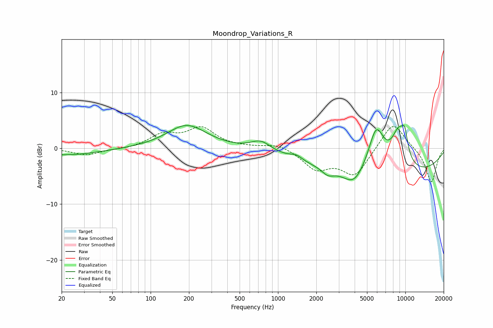

# Moondrop_Variations_R
See [usage instructions](https://github.com/jaakkopasanen/AutoEq#usage) for more options and info.

### Parametric EQs
Apply preamp of -4.2 dB when using parametric equalizer.

|   # | Type    |   Fc (Hz) |    Q |   Gain (dB) |
|-----|---------|-----------|------|-------------|
|   1 | Peaking |        22 | 0.56 |        -1.2 |
|   2 | Peaking |       192 | 0.92 |         4.2 |
|   3 | Peaking |       732 | 1.86 |         1.7 |
|   4 | Peaking |      1391 | 3.23 |         0.8 |
|   5 | Peaking |      2466 | 3.03 |        -1.2 |
|   6 | Peaking |      3950 | 1.8  |        -2.8 |
|   7 | Peaking |      5906 | 2.13 |         7.9 |
|   8 | Peaking |      7269 | 0.21 |        -5.1 |
|   9 | Peaking |      8876 | 2.17 |         6.6 |
|  10 | Peaking |      9890 | 5.32 |         3.4 |

### Fixed Band EQs
When using fixed band (also called graphic) equalizer, apply preamp of **-4.0 dB** (if available) and set gains manually with these parameters.

|   # | Type    |   Fc (Hz) |    Q |   Gain (dB) |
|-----|---------|-----------|------|-------------|
|   1 | Peaking |        31 | 1.41 |        -1.2 |
|   2 | Peaking |        62 | 1.41 |        -0.2 |
|   3 | Peaking |       125 | 1.41 |         2.3 |
|   4 | Peaking |       250 | 1.41 |         3.4 |
|   5 | Peaking |       500 | 1.41 |         0.1 |
|   6 | Peaking |      1000 | 1.41 |         0.9 |
|   7 | Peaking |      2000 | 1.41 |        -3.5 |
|   8 | Peaking |      4000 | 1.41 |        -4.8 |
|   9 | Peaking |      8000 | 1.41 |         5   |
|  10 | Peaking |     16000 | 1.41 |        -6.2 |

### Graphs

