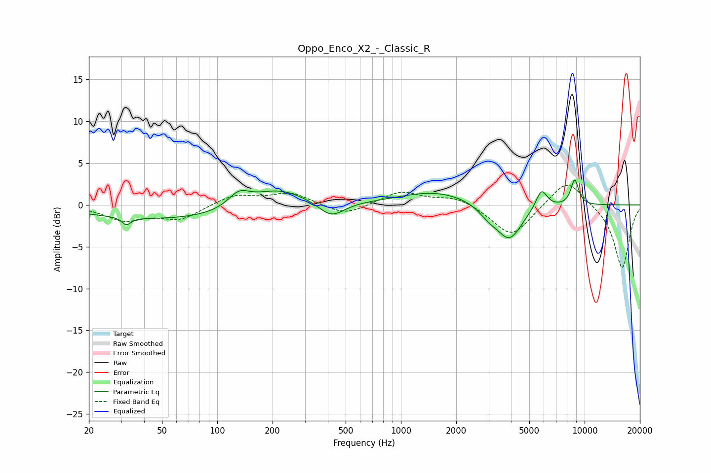

# Oppo_Enco_X2_-_Classic_R
See [usage instructions](https://github.com/jaakkopasanen/AutoEq#usage) for more options and info.

### Parametric EQs
Apply preamp of -3.0 dB when using parametric equalizer.

|   # | Type    |   Fc (Hz) |    Q |   Gain (dB) |
|-----|---------|-----------|------|-------------|
|   1 | Peaking |        32 | 6    |        -0.9 |
|   2 | Peaking |        63 | 0.28 |        -1.8 |
|   3 | Peaking |       131 | 2.4  |         1.7 |
|   4 | Peaking |       212 | 0.89 |         2.6 |
|   5 | Peaking |       418 | 2.01 |        -1.9 |
|   6 | Peaking |      1554 | 0.7  |         1.6 |
|   7 | Peaking |      2998 | 2.63 |        -1   |
|   8 | Peaking |      3892 | 1.98 |        -4.2 |
|   9 | Peaking |      5820 | 4.42 |         2.4 |
|  10 | Peaking |      8834 | 6    |         3.1 |

### Fixed Band EQs
When using fixed band (also called graphic) equalizer, apply preamp of **-2.5 dB** (if available) and set gains manually with these parameters.

|   # | Type    |   Fc (Hz) |    Q |   Gain (dB) |
|-----|---------|-----------|------|-------------|
|   1 | Peaking |        31 | 1.41 |        -1.7 |
|   2 | Peaking |        62 | 1.41 |        -1.7 |
|   3 | Peaking |       125 | 1.41 |         1.2 |
|   4 | Peaking |       250 | 1.41 |         1.4 |
|   5 | Peaking |       500 | 1.41 |        -1.3 |
|   6 | Peaking |      1000 | 1.41 |         1.6 |
|   7 | Peaking |      2000 | 1.41 |         1   |
|   8 | Peaking |      4000 | 1.41 |        -3.9 |
|   9 | Peaking |      8000 | 1.41 |         3.3 |
|  10 | Peaking |     16000 | 1.41 |        -7.6 |

### Graphs

