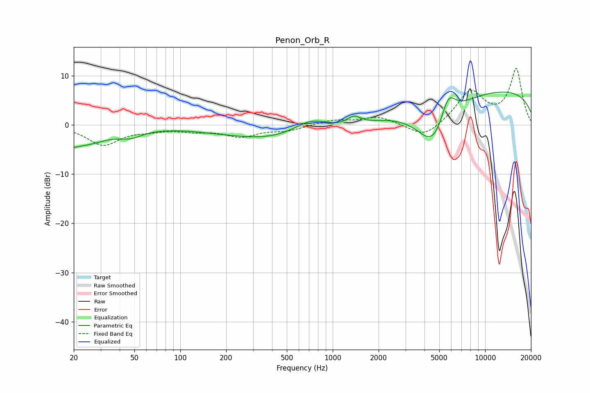

# Penon_Orb_R
See [usage instructions](https://github.com/jaakkopasanen/AutoEq#usage) for more options and info.

### Parametric EQs
Apply preamp of -6.7 dB when using parametric equalizer.

|   # | Type    |   Fc (Hz) |    Q |   Gain (dB) |
|-----|---------|-----------|------|-------------|
|   1 | Peaking |        20 | 5.69 |        -0.6 |
|   2 | Peaking |        22 | 0.86 |        -3.9 |
|   3 | Peaking |        48 | 1.91 |        -1.3 |
|   4 | Peaking |       137 | 3.75 |        -0   |
|   5 | Peaking |       539 | 0.33 |        -3.6 |
|   6 | Peaking |       721 | 1.16 |         3.5 |
|   7 | Peaking |      1377 | 3.23 |         1.7 |
|   8 | Peaking |      4586 | 1.19 |        -9.9 |
|   9 | Peaking |      5725 | 2.81 |         5.7 |
|  10 | Peaking |     10000 | 0.18 |         7.4 |

### Fixed Band EQs
When using fixed band (also called graphic) equalizer, apply preamp of **-11.6 dB** (if available) and set gains manually with these parameters.

|   # | Type    |   Fc (Hz) |    Q |   Gain (dB) |
|-----|---------|-----------|------|-------------|
|   1 | Peaking |        31 | 1.41 |        -4   |
|   2 | Peaking |        62 | 1.41 |        -0.8 |
|   3 | Peaking |       125 | 1.41 |        -1   |
|   4 | Peaking |       250 | 1.41 |        -2.2 |
|   5 | Peaking |       500 | 1.41 |        -1   |
|   6 | Peaking |      1000 | 1.41 |         0.9 |
|   7 | Peaking |      2000 | 1.41 |         1.6 |
|   8 | Peaking |      4000 | 1.41 |        -2.9 |
|   9 | Peaking |      8000 | 1.41 |         6.7 |
|  10 | Peaking |     16000 | 1.41 |        11.2 |

### Graphs

