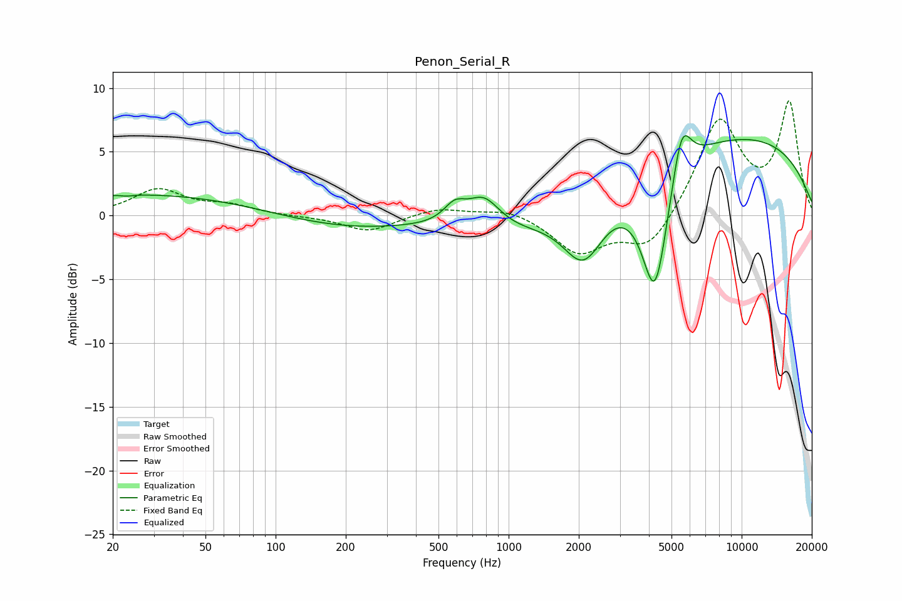

# Penon_Serial_R
See [usage instructions](https://github.com/jaakkopasanen/AutoEq#usage) for more options and info.

### Parametric EQs
Apply preamp of -6.4 dB when using parametric equalizer.

|   # | Type    |   Fc (Hz) |    Q |   Gain (dB) |
|-----|---------|-----------|------|-------------|
|   1 | Peaking |        23 | 5.96 |        -0.1 |
|   2 | Peaking |        30 | 0.27 |         1.7 |
|   3 | Peaking |       186 | 0.44 |        -1.1 |
|   4 | Peaking |       587 | 3.02 |         1.4 |
|   5 | Peaking |       783 | 1.97 |         2.4 |
|   6 | Peaking |      1039 | 0.63 |        -1.5 |
|   7 | Peaking |      2100 | 1.57 |        -4.9 |
|   8 | Peaking |      4251 | 2.31 |       -10.3 |
|   9 | Peaking |      5521 | 3.36 |         4.3 |
|  10 | Peaking |      8772 | 0.24 |         6.4 |

### Fixed Band EQs
When using fixed band (also called graphic) equalizer, apply preamp of **-9.1 dB** (if available) and set gains manually with these parameters.

|   # | Type    |   Fc (Hz) |    Q |   Gain (dB) |
|-----|---------|-----------|------|-------------|
|   1 | Peaking |        31 | 1.41 |         2   |
|   2 | Peaking |        62 | 1.41 |         0.7 |
|   3 | Peaking |       125 | 1.41 |        -0.1 |
|   4 | Peaking |       250 | 1.41 |        -1.3 |
|   5 | Peaking |       500 | 1.41 |         0.6 |
|   6 | Peaking |      1000 | 1.41 |         0.6 |
|   7 | Peaking |      2000 | 1.41 |        -2.9 |
|   8 | Peaking |      4000 | 1.41 |        -2.8 |
|   9 | Peaking |      8000 | 1.41 |         7.5 |
|  10 | Peaking |     16000 | 1.41 |         8.7 |

### Graphs

