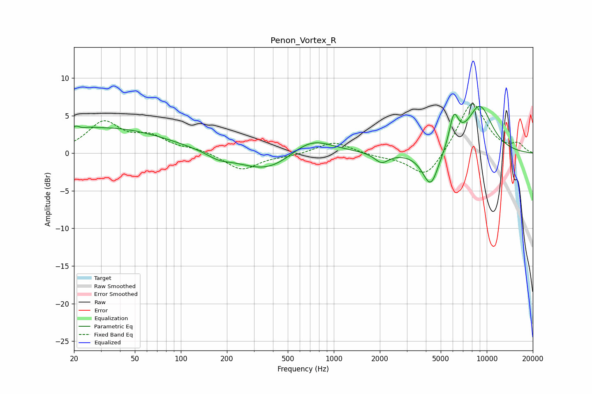

# Penon_Vortex_R
See [usage instructions](https://github.com/jaakkopasanen/AutoEq#usage) for more options and info.

### Parametric EQs
Apply preamp of -6.3 dB when using parametric equalizer.

|   # | Type    |   Fc (Hz) |    Q |   Gain (dB) |
|-----|---------|-----------|------|-------------|
|   1 | Peaking |        21 | 5.98 |         0.6 |
|   2 | Peaking |        25 | 5.86 |         0.1 |
|   3 | Peaking |        32 | 0.36 |         3.4 |
|   4 | Peaking |       176 | 1.92 |        -0.7 |
|   5 | Peaking |       375 | 0.74 |        -2.8 |
|   6 | Peaking |       698 | 0.97 |         2.7 |
|   7 | Peaking |      2054 | 3.1  |        -1.3 |
|   8 | Peaking |      4297 | 2.61 |        -4.8 |
|   9 | Peaking |      6093 | 4.46 |         4.1 |
|  10 | Peaking |      8982 | 1.49 |         6.2 |

### Fixed Band EQs
When using fixed band (also called graphic) equalizer, apply preamp of **-6.6 dB** (if available) and set gains manually with these parameters.

|   # | Type    |   Fc (Hz) |    Q |   Gain (dB) |
|-----|---------|-----------|------|-------------|
|   1 | Peaking |        31 | 1.41 |         4   |
|   2 | Peaking |        62 | 1.41 |         1.9 |
|   3 | Peaking |       125 | 1.41 |         0.5 |
|   4 | Peaking |       250 | 1.41 |        -2.3 |
|   5 | Peaking |       500 | 1.41 |        -0.3 |
|   6 | Peaking |      1000 | 1.41 |         1.6 |
|   7 | Peaking |      2000 | 1.41 |        -0.4 |
|   8 | Peaking |      4000 | 1.41 |        -3.5 |
|   9 | Peaking |      8000 | 1.41 |         7   |
|  10 | Peaking |     16000 | 1.41 |         1.1 |

### Graphs

