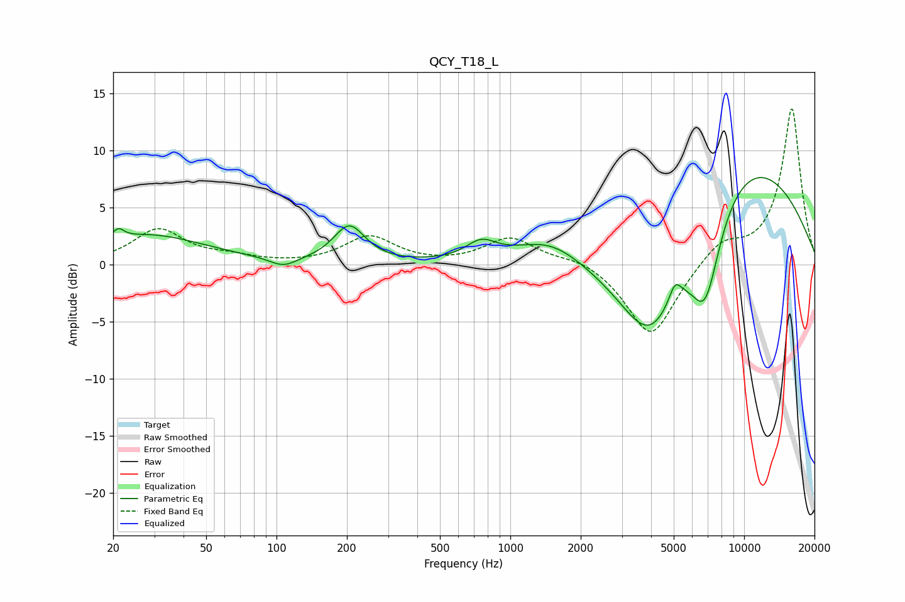

# QCY_T18_L
See [usage instructions](https://github.com/jaakkopasanen/AutoEq#usage) for more options and info.

### Parametric EQs
Apply preamp of -7.7 dB when using parametric equalizer.

|   # | Type    |   Fc (Hz) |    Q |   Gain (dB) |
|-----|---------|-----------|------|-------------|
|   1 | Peaking |        21 | 6    |         0.8 |
|   2 | Peaking |        28 | 0.58 |         2.5 |
|   3 | Peaking |       107 | 2.43 |        -0.9 |
|   4 | Peaking |       205 | 2.12 |         3.2 |
|   5 | Peaking |       751 | 2.18 |         1.5 |
|   6 | Peaking |      1475 | 0.97 |         2.2 |
|   7 | Peaking |      3982 | 0.8  |       -12.5 |
|   8 | Peaking |      5063 | 5.4  |         1.6 |
|   9 | Peaking |      6823 | 2.02 |        -7.9 |
|  10 | Peaking |      8439 | 0.33 |        11.4 |

### Fixed Band EQs
When using fixed band (also called graphic) equalizer, apply preamp of **-13.7 dB** (if available) and set gains manually with these parameters.

|   # | Type    |   Fc (Hz) |    Q |   Gain (dB) |
|-----|---------|-----------|------|-------------|
|   1 | Peaking |        31 | 1.41 |         3   |
|   2 | Peaking |        62 | 1.41 |         0.5 |
|   3 | Peaking |       125 | 1.41 |        -0   |
|   4 | Peaking |       250 | 1.41 |         2.4 |
|   5 | Peaking |       500 | 1.41 |        -0   |
|   6 | Peaking |      1000 | 1.41 |         2.3 |
|   7 | Peaking |      2000 | 1.41 |         0.7 |
|   8 | Peaking |      4000 | 1.41 |        -6.5 |
|   9 | Peaking |      8000 | 1.41 |         1.9 |
|  10 | Peaking |     16000 | 1.41 |        13.7 |

### Graphs

