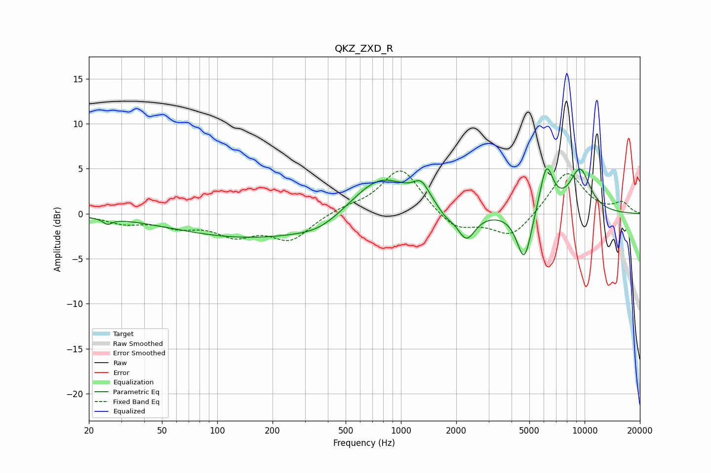

# QKZ_ZXD_R
See [usage instructions](https://github.com/jaakkopasanen/AutoEq#usage) for more options and info.

### Parametric EQs
Apply preamp of -5.1 dB when using parametric equalizer.

|   # | Type    |   Fc (Hz) |    Q |   Gain (dB) |
|-----|---------|-----------|------|-------------|
|   1 | Peaking |        25 | 5.67 |        -0.6 |
|   2 | Peaking |       160 | 0.33 |        -2.7 |
|   3 | Peaking |       362 | 1.14 |        -0.9 |
|   4 | Peaking |       771 | 0.86 |         4.6 |
|   5 | Peaking |      1290 | 3.27 |         1.9 |
|   6 | Peaking |      1757 | 3.26 |        -0.8 |
|   7 | Peaking |      2270 | 2.87 |        -3.2 |
|   8 | Peaking |      4696 | 3.42 |        -5.7 |
|   9 | Peaking |      6192 | 3.63 |         5.3 |
|  10 | Peaking |      9445 | 2.17 |         4.8 |

### Fixed Band EQs
When using fixed band (also called graphic) equalizer, apply preamp of **-4.8 dB** (if available) and set gains manually with these parameters.

|   # | Type    |   Fc (Hz) |    Q |   Gain (dB) |
|-----|---------|-----------|------|-------------|
|   1 | Peaking |        31 | 1.41 |        -1   |
|   2 | Peaking |        62 | 1.41 |        -1.2 |
|   3 | Peaking |       125 | 1.41 |        -2.1 |
|   4 | Peaking |       250 | 1.41 |        -2.8 |
|   5 | Peaking |       500 | 1.41 |         0.6 |
|   6 | Peaking |      1000 | 1.41 |         5.2 |
|   7 | Peaking |      2000 | 1.41 |        -2   |
|   8 | Peaking |      4000 | 1.41 |        -2.7 |
|   9 | Peaking |      8000 | 1.41 |         4.8 |
|  10 | Peaking |     16000 | 1.41 |         1.1 |

### Graphs

