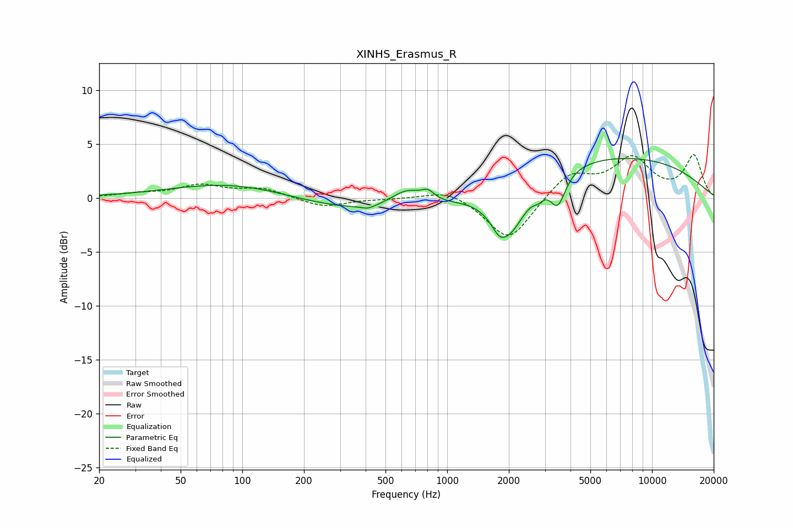

# XINHS_Erasmus_R
See [usage instructions](https://github.com/jaakkopasanen/AutoEq#usage) for more options and info.

### Parametric EQs
Apply preamp of -3.8 dB when using parametric equalizer.

|   # | Type    |   Fc (Hz) |    Q |   Gain (dB) |
|-----|---------|-----------|------|-------------|
|   1 | Peaking |        96 | 0.46 |         1.6 |
|   2 | Peaking |       411 | 4.42 |        -0.3 |
|   3 | Peaking |       456 | 0.3  |        -1.6 |
|   4 | Peaking |       634 | 1.8  |         1.6 |
|   5 | Peaking |       806 | 4.47 |         0.8 |
|   6 | Peaking |      1791 | 4.24 |        -0.9 |
|   7 | Peaking |      1995 | 1.67 |        -4.8 |
|   8 | Peaking |      2787 | 5.83 |        -0.6 |
|   9 | Peaking |      3469 | 3.75 |        -2.9 |
|  10 | Peaking |      6013 | 0.25 |         4   |

### Fixed Band EQs
When using fixed band (also called graphic) equalizer, apply preamp of **-4.1 dB** (if available) and set gains manually with these parameters.

|   # | Type    |   Fc (Hz) |    Q |   Gain (dB) |
|-----|---------|-----------|------|-------------|
|   1 | Peaking |        31 | 1.41 |         0.3 |
|   2 | Peaking |        62 | 1.41 |         1.1 |
|   3 | Peaking |       125 | 1.41 |         0.8 |
|   4 | Peaking |       250 | 1.41 |        -0.9 |
|   5 | Peaking |       500 | 1.41 |        -0.1 |
|   6 | Peaking |      1000 | 1.41 |         0.9 |
|   7 | Peaking |      2000 | 1.41 |        -4.1 |
|   8 | Peaking |      4000 | 1.41 |         2.3 |
|   9 | Peaking |      8000 | 1.41 |         3.5 |
|  10 | Peaking |     16000 | 1.41 |         3.8 |

### Graphs

