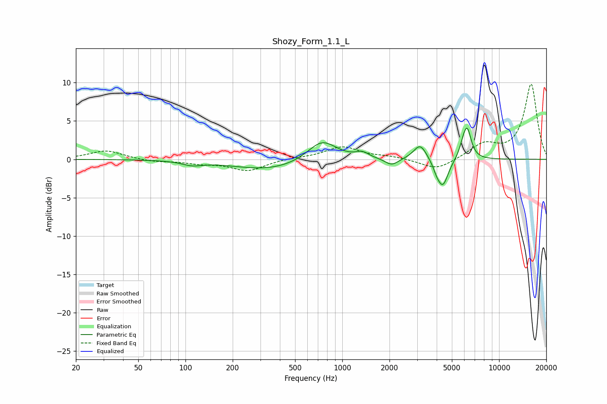

# Shozy_Form_1.1_L
See [usage instructions](https://github.com/jaakkopasanen/AutoEq#usage) for more options and info.

### Parametric EQs
Apply preamp of -4.2 dB when using parametric equalizer.

|   # | Type    |   Fc (Hz) |    Q |   Gain (dB) |
|-----|---------|-----------|------|-------------|
|   1 | Peaking |       111 | 2.23 |        -0.5 |
|   2 | Peaking |       345 | 0.6  |        -1.4 |
|   3 | Peaking |       743 | 1.52 |         2.8 |
|   4 | Peaking |      1341 | 3.45 |         0.7 |
|   5 | Peaking |      2066 | 3.37 |        -0.9 |
|   6 | Peaking |      3139 | 3.39 |         2.1 |
|   7 | Peaking |      4004 | 6    |        -0.8 |
|   8 | Peaking |      4380 | 4.03 |        -3.5 |
|   9 | Peaking |      5889 | 5.97 |         1.2 |
|  10 | Peaking |      6268 | 5.35 |         3.6 |

### Fixed Band EQs
When using fixed band (also called graphic) equalizer, apply preamp of **-9.9 dB** (if available) and set gains manually with these parameters.

|   # | Type    |   Fc (Hz) |    Q |   Gain (dB) |
|-----|---------|-----------|------|-------------|
|   1 | Peaking |        31 | 1.41 |         1.2 |
|   2 | Peaking |        62 | 1.41 |        -0.3 |
|   3 | Peaking |       125 | 1.41 |        -0.5 |
|   4 | Peaking |       250 | 1.41 |        -1.5 |
|   5 | Peaking |       500 | 1.41 |         0.2 |
|   6 | Peaking |      1000 | 1.41 |         1.6 |
|   7 | Peaking |      2000 | 1.41 |         0.3 |
|   8 | Peaking |      4000 | 1.41 |        -1.5 |
|   9 | Peaking |      8000 | 1.41 |         1.9 |
|  10 | Peaking |     16000 | 1.41 |         9.8 |

### Graphs

