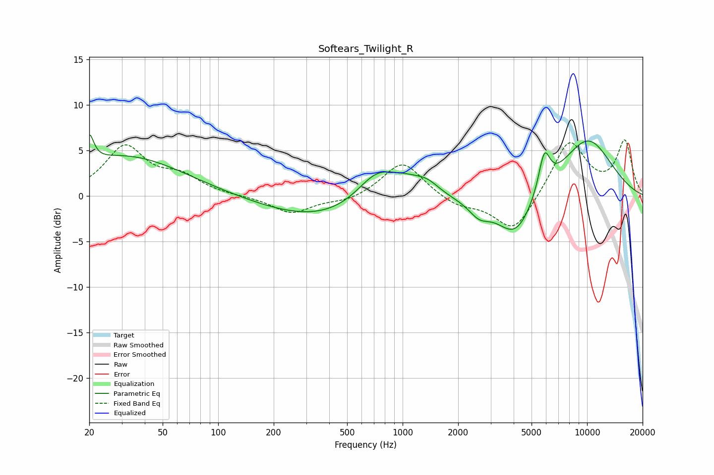

# Softears_Twilight_R
See [usage instructions](https://github.com/jaakkopasanen/AutoEq#usage) for more options and info.

### Parametric EQs
Apply preamp of -6.8 dB when using parametric equalizer.

|   # | Type    |   Fc (Hz) |    Q |   Gain (dB) |
|-----|---------|-----------|------|-------------|
|   1 | Peaking |        20 | 6    |         3   |
|   2 | Peaking |        31 | 0.45 |         4.4 |
|   3 | Peaking |       367 | 0.44 |        -2.6 |
|   4 | Peaking |       725 | 1.26 |         3.5 |
|   5 | Peaking |      1058 | 1.47 |         1.4 |
|   6 | Peaking |      1363 | 2.18 |         1.1 |
|   7 | Peaking |      2598 | 2.44 |        -1.5 |
|   8 | Peaking |      4093 | 1.36 |        -4.9 |
|   9 | Peaking |      5862 | 4.4  |         4.2 |
|  10 | Peaking |     10000 | 0.8  |         6.3 |

### Fixed Band EQs
When using fixed band (also called graphic) equalizer, apply preamp of **-6.3 dB** (if available) and set gains manually with these parameters.

|   # | Type    |   Fc (Hz) |    Q |   Gain (dB) |
|-----|---------|-----------|------|-------------|
|   1 | Peaking |        31 | 1.41 |         5.3 |
|   2 | Peaking |        62 | 1.41 |         1.9 |
|   3 | Peaking |       125 | 1.41 |        -0   |
|   4 | Peaking |       250 | 1.41 |        -1.9 |
|   5 | Peaking |       500 | 1.41 |        -0.6 |
|   6 | Peaking |      1000 | 1.41 |         3.9 |
|   7 | Peaking |      2000 | 1.41 |        -1.1 |
|   8 | Peaking |      4000 | 1.41 |        -4.1 |
|   9 | Peaking |      8000 | 1.41 |         6.1 |
|  10 | Peaking |     16000 | 1.41 |         5.9 |

### Graphs

