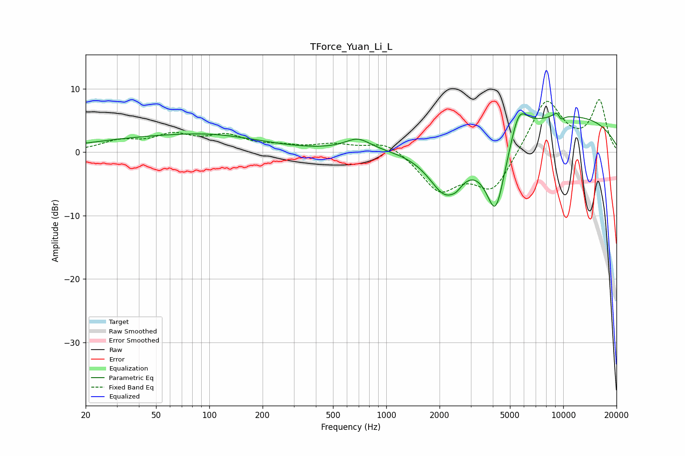

# TForce_Yuan_Li_L
See [usage instructions](https://github.com/jaakkopasanen/AutoEq#usage) for more options and info.

### Parametric EQs
Apply preamp of -6.2 dB when using parametric equalizer.

|   # | Type    |   Fc (Hz) |    Q |   Gain (dB) |
|-----|---------|-----------|------|-------------|
|   1 | Peaking |        58 | 0.32 |         2.2 |
|   2 | Peaking |       118 | 0.58 |         0.9 |
|   3 | Peaking |       691 | 1.9  |         1.9 |
|   4 | Peaking |      2172 | 1.35 |        -8.5 |
|   5 | Peaking |      2497 | 5.07 |        -0.6 |
|   6 | Peaking |      4153 | 2.14 |       -13   |
|   7 | Peaking |      5600 | 2.79 |         5.2 |
|   8 | Peaking |      8478 | 0.22 |         6.2 |
|   9 | Peaking |      9411 | 5.42 |         2.7 |
|  10 | Peaking |      9583 | 5.95 |        -2.6 |

### Fixed Band EQs
When using fixed band (also called graphic) equalizer, apply preamp of **-8.4 dB** (if available) and set gains manually with these parameters.

|   # | Type    |   Fc (Hz) |    Q |   Gain (dB) |
|-----|---------|-----------|------|-------------|
|   1 | Peaking |        31 | 1.41 |         1.6 |
|   2 | Peaking |        62 | 1.41 |         2.4 |
|   3 | Peaking |       125 | 1.41 |         2.3 |
|   4 | Peaking |       250 | 1.41 |         0.7 |
|   5 | Peaking |       500 | 1.41 |         1.1 |
|   6 | Peaking |      1000 | 1.41 |         1.9 |
|   7 | Peaking |      2000 | 1.41 |        -5.8 |
|   8 | Peaking |      4000 | 1.41 |        -6.1 |
|   9 | Peaking |      8000 | 1.41 |         8.6 |
|  10 | Peaking |     16000 | 1.41 |         7.9 |

### Graphs

