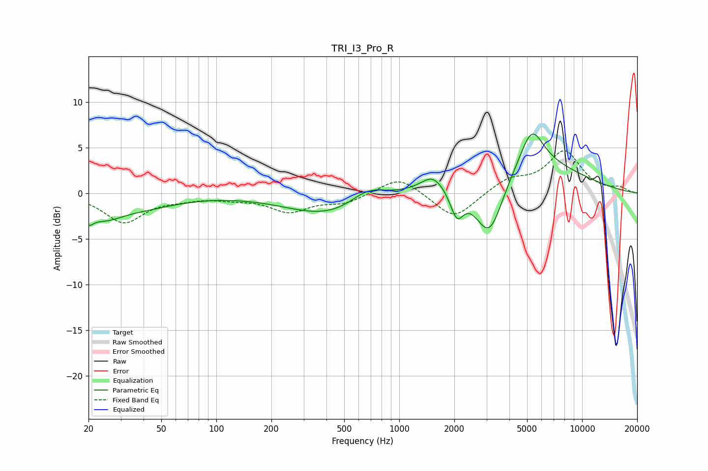

# TRI_I3_Pro_R
See [usage instructions](https://github.com/jaakkopasanen/AutoEq#usage) for more options and info.

### Parametric EQs
Apply preamp of -6.6 dB when using parametric equalizer.

|   # | Type    |   Fc (Hz) |    Q |   Gain (dB) |
|-----|---------|-----------|------|-------------|
|   1 | Peaking |        20 | 5.65 |        -1.2 |
|   2 | Peaking |        24 | 1.32 |        -2   |
|   3 | Peaking |        39 | 0.7  |        -1.3 |
|   4 | Peaking |       418 | 0.61 |        -2.5 |
|   5 | Peaking |       672 | 1.44 |         1.7 |
|   6 | Peaking |      1523 | 2.32 |         1.6 |
|   7 | Peaking |      2065 | 3.83 |        -3.1 |
|   8 | Peaking |      3107 | 1.69 |        -7.6 |
|   9 | Peaking |      4488 | 0.46 |         4.1 |
|  10 | Peaking |      5308 | 2.22 |         4.1 |

### Fixed Band EQs
When using fixed band (also called graphic) equalizer, apply preamp of **-4.8 dB** (if available) and set gains manually with these parameters.

|   # | Type    |   Fc (Hz) |    Q |   Gain (dB) |
|-----|---------|-----------|------|-------------|
|   1 | Peaking |        31 | 1.41 |        -3.1 |
|   2 | Peaking |        62 | 1.41 |        -0.4 |
|   3 | Peaking |       125 | 1.41 |        -0.4 |
|   4 | Peaking |       250 | 1.41 |        -1.9 |
|   5 | Peaking |       500 | 1.41 |        -1   |
|   6 | Peaking |      1000 | 1.41 |         1.9 |
|   7 | Peaking |      2000 | 1.41 |        -2.9 |
|   8 | Peaking |      4000 | 1.41 |         1.5 |
|   9 | Peaking |      8000 | 1.41 |         4.5 |
|  10 | Peaking |     16000 | 1.41 |         0.5 |

### Graphs

