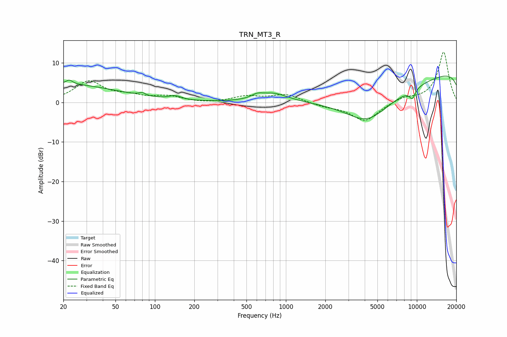

# TRN_MT3_R
See [usage instructions](https://github.com/jaakkopasanen/AutoEq#usage) for more options and info.

### Parametric EQs
Apply preamp of -6.8 dB when using parametric equalizer.

|   # | Type    |   Fc (Hz) |    Q |   Gain (dB) |
|-----|---------|-----------|------|-------------|
|   1 | Peaking |        20 | 0.34 |         4.6 |
|   2 | Peaking |        22 | 5.54 |         1.1 |
|   3 | Peaking |        80 | 5.92 |         0.7 |
|   4 | Peaking |       143 | 3.05 |         1   |
|   5 | Peaking |       603 | 3.32 |         0.9 |
|   6 | Peaking |       805 | 1.28 |         2.2 |
|   7 | Peaking |      4181 | 0.85 |        -6.1 |
|   8 | Peaking |      6813 | 0.24 |       -11   |
|   9 | Peaking |      9236 | 5.43 |        -2.3 |
|  10 | Peaking |     10000 | 0.18 |        15.4 |

### Fixed Band EQs
When using fixed band (also called graphic) equalizer, apply preamp of **-12.8 dB** (if available) and set gains manually with these parameters.

|   # | Type    |   Fc (Hz) |    Q |   Gain (dB) |
|-----|---------|-----------|------|-------------|
|   1 | Peaking |        31 | 1.41 |         5.2 |
|   2 | Peaking |        62 | 1.41 |         1.3 |
|   3 | Peaking |       125 | 1.41 |         1.4 |
|   4 | Peaking |       250 | 1.41 |        -0.3 |
|   5 | Peaking |       500 | 1.41 |         1.4 |
|   6 | Peaking |      1000 | 1.41 |         2   |
|   7 | Peaking |      2000 | 1.41 |        -0.9 |
|   8 | Peaking |      4000 | 1.41 |        -4.8 |
|   9 | Peaking |      8000 | 1.41 |         1.2 |
|  10 | Peaking |     16000 | 1.41 |        12.8 |

### Graphs

