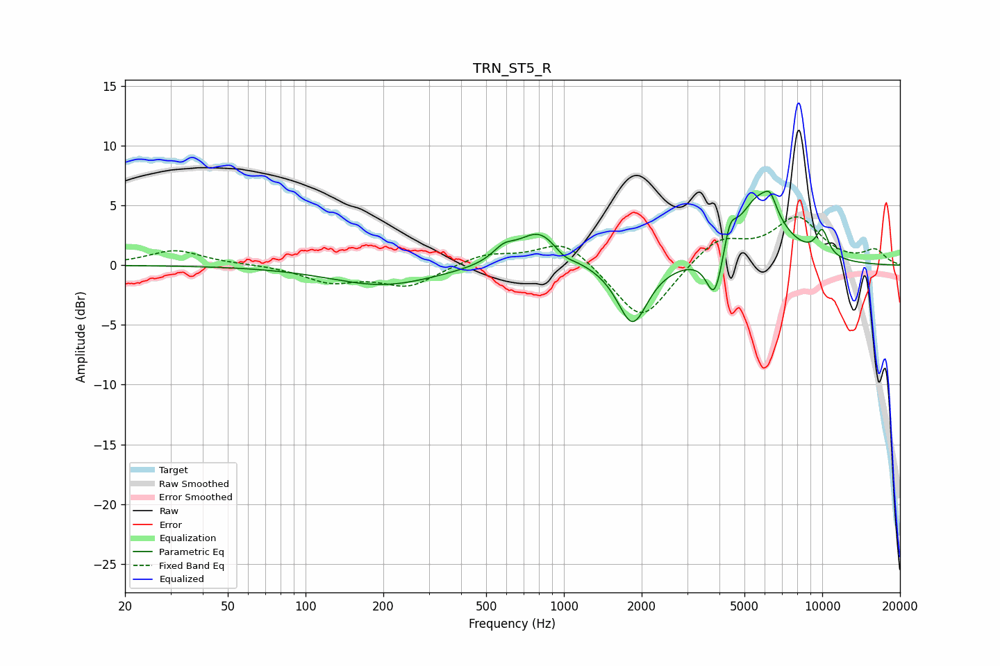

# TRN_ST5_R
See [usage instructions](https://github.com/jaakkopasanen/AutoEq#usage) for more options and info.

### Parametric EQs
Apply preamp of -6.3 dB when using parametric equalizer.

|   # | Type    |   Fc (Hz) |    Q |   Gain (dB) |
|-----|---------|-----------|------|-------------|
|   1 | Peaking |       200 | 0.69 |        -1.7 |
|   2 | Peaking |       584 | 3.35 |         1   |
|   3 | Peaking |       806 | 1.67 |         3   |
|   4 | Peaking |       995 | 3.5  |        -0.7 |
|   5 | Peaking |      1844 | 2.42 |        -5.1 |
|   6 | Peaking |      3835 | 4.39 |        -4.1 |
|   7 | Peaking |      4394 | 6    |         2.1 |
|   8 | Peaking |      5690 | 1.61 |         5.6 |
|   9 | Peaking |      6291 | 6    |         1.3 |
|  10 | Peaking |     10000 | 4.91 |         2.2 |

### Fixed Band EQs
When using fixed band (also called graphic) equalizer, apply preamp of **-4.1 dB** (if available) and set gains manually with these parameters.

|   # | Type    |   Fc (Hz) |    Q |   Gain (dB) |
|-----|---------|-----------|------|-------------|
|   1 | Peaking |        31 | 1.41 |         1.3 |
|   2 | Peaking |        62 | 1.41 |         0.1 |
|   3 | Peaking |       125 | 1.41 |        -1.3 |
|   4 | Peaking |       250 | 1.41 |        -1.7 |
|   5 | Peaking |       500 | 1.41 |         0.9 |
|   6 | Peaking |      1000 | 1.41 |         2.2 |
|   7 | Peaking |      2000 | 1.41 |        -4.9 |
|   8 | Peaking |      4000 | 1.41 |         2.3 |
|   9 | Peaking |      8000 | 1.41 |         3.8 |
|  10 | Peaking |     16000 | 1.41 |         1.2 |

### Graphs

