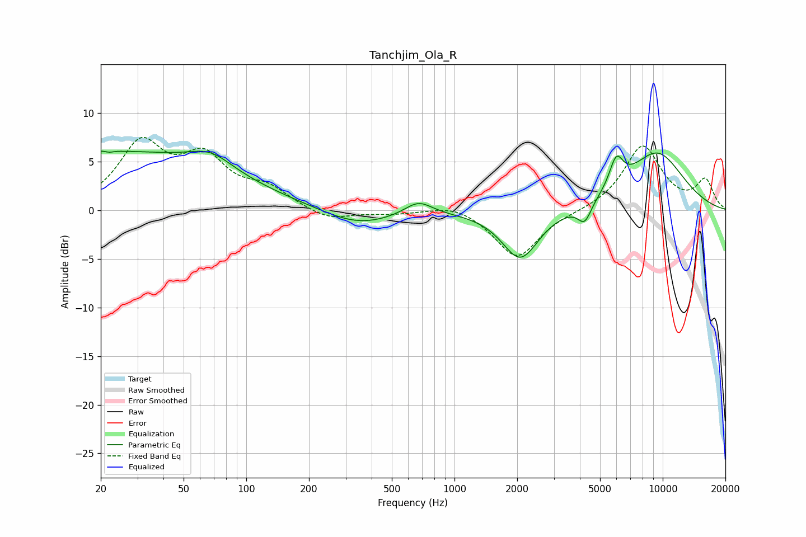

# Tanchjim_Ola_R
See [usage instructions](https://github.com/jaakkopasanen/AutoEq#usage) for more options and info.

### Parametric EQs
Apply preamp of -6.2 dB when using parametric equalizer.

|   # | Type    |   Fc (Hz) |    Q |   Gain (dB) |
|-----|---------|-----------|------|-------------|
|   1 | Peaking |        21 | 0.21 |         6   |
|   2 | Peaking |        22 | 5.74 |         3.3 |
|   3 | Peaking |        22 | 5.9  |        -3.4 |
|   4 | Peaking |        68 | 1.38 |         1.7 |
|   5 | Peaking |       343 | 0.84 |        -1.7 |
|   6 | Peaking |       671 | 2.13 |         1.4 |
|   7 | Peaking |      2071 | 1.6  |        -5.1 |
|   8 | Peaking |      4218 | 4.33 |        -2   |
|   9 | Peaking |      5983 | 4.05 |         3.1 |
|  10 | Peaking |      9356 | 0.89 |         5.8 |

### Fixed Band EQs
When using fixed band (also called graphic) equalizer, apply preamp of **-7.6 dB** (if available) and set gains manually with these parameters.

|   # | Type    |   Fc (Hz) |    Q |   Gain (dB) |
|-----|---------|-----------|------|-------------|
|   1 | Peaking |        31 | 1.41 |         6.5 |
|   2 | Peaking |        62 | 1.41 |         4.8 |
|   3 | Peaking |       125 | 1.41 |         2   |
|   4 | Peaking |       250 | 1.41 |        -1.1 |
|   5 | Peaking |       500 | 1.41 |        -0.3 |
|   6 | Peaking |      1000 | 1.41 |         0.8 |
|   7 | Peaking |      2000 | 1.41 |        -5   |
|   8 | Peaking |      4000 | 1.41 |        -0.1 |
|   9 | Peaking |      8000 | 1.41 |         6.6 |
|  10 | Peaking |     16000 | 1.41 |         3   |

### Graphs

