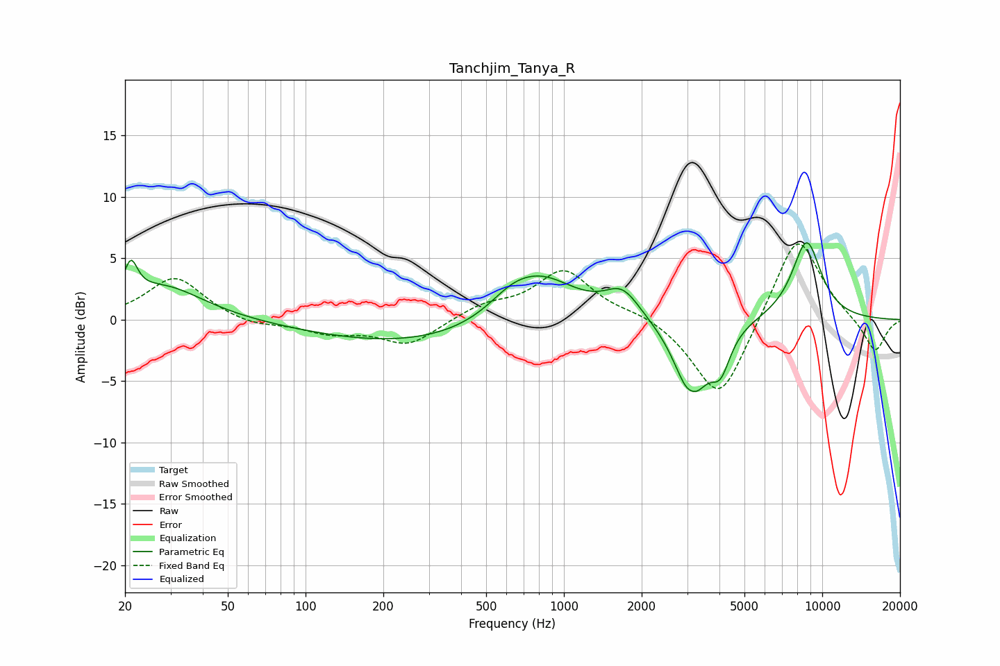

# Tanchjim_Tanya_R
See [usage instructions](https://github.com/jaakkopasanen/AutoEq#usage) for more options and info.

### Parametric EQs
Apply preamp of -6.4 dB when using parametric equalizer.

|   # | Type    |   Fc (Hz) |    Q |   Gain (dB) |
|-----|---------|-----------|------|-------------|
|   1 | Peaking |        21 | 5.44 |         2.8 |
|   2 | Peaking |        28 | 0.91 |         2.7 |
|   3 | Peaking |       263 | 0.36 |        -2   |
|   4 | Peaking |       623 | 1.62 |         1.1 |
|   5 | Peaking |       808 | 0.97 |         3.8 |
|   6 | Peaking |      1686 | 2.09 |         2.2 |
|   7 | Peaking |      3112 | 2.24 |        -6.4 |
|   8 | Peaking |      3125 | 5.77 |         0.5 |
|   9 | Peaking |      4040 | 3.71 |        -2.9 |
|  10 | Peaking |      8700 | 2.2  |         6.4 |

### Fixed Band EQs
When using fixed band (also called graphic) equalizer, apply preamp of **-6.3 dB** (if available) and set gains manually with these parameters.

|   # | Type    |   Fc (Hz) |    Q |   Gain (dB) |
|-----|---------|-----------|------|-------------|
|   1 | Peaking |        31 | 1.41 |         3.5 |
|   2 | Peaking |        62 | 1.41 |        -0.6 |
|   3 | Peaking |       125 | 1.41 |        -1   |
|   4 | Peaking |       250 | 1.41 |        -2   |
|   5 | Peaking |       500 | 1.41 |         1.1 |
|   6 | Peaking |      1000 | 1.41 |         4   |
|   7 | Peaking |      2000 | 1.41 |         0.6 |
|   8 | Peaking |      4000 | 1.41 |        -6.9 |
|   9 | Peaking |      8000 | 1.41 |         7.3 |
|  10 | Peaking |     16000 | 1.41 |        -2.8 |

### Graphs

