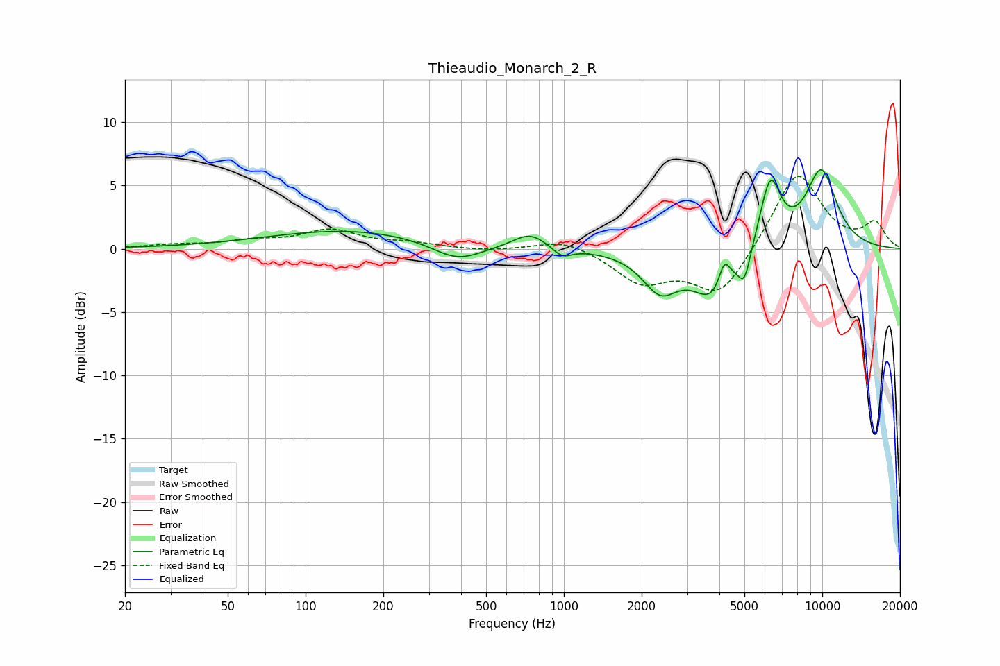

# Thieaudio_Monarch_2_R
See [usage instructions](https://github.com/jaakkopasanen/AutoEq#usage) for more options and info.

### Parametric EQs
Apply preamp of -6.3 dB when using parametric equalizer.

|   # | Type    |   Fc (Hz) |    Q |   Gain (dB) |
|-----|---------|-----------|------|-------------|
|   1 | Peaking |       147 | 0.45 |         1.5 |
|   2 | Peaking |       386 | 1.47 |        -1.4 |
|   3 | Peaking |       739 | 2.14 |         1.2 |
|   4 | Peaking |       985 | 3.91 |        -0.8 |
|   5 | Peaking |      2360 | 2.04 |        -3   |
|   6 | Peaking |      3835 | 1.75 |        -4   |
|   7 | Peaking |      4174 | 6    |         2.3 |
|   8 | Peaking |      5000 | 5.94 |        -2.2 |
|   9 | Peaking |      6295 | 3.32 |         5.5 |
|  10 | Peaking |      9906 | 1.96 |         6.1 |

### Fixed Band EQs
When using fixed band (also called graphic) equalizer, apply preamp of **-5.8 dB** (if available) and set gains manually with these parameters.

|   # | Type    |   Fc (Hz) |    Q |   Gain (dB) |
|-----|---------|-----------|------|-------------|
|   1 | Peaking |        31 | 1.41 |         0.3 |
|   2 | Peaking |        62 | 1.41 |         0.5 |
|   3 | Peaking |       125 | 1.41 |         1.4 |
|   4 | Peaking |       250 | 1.41 |         0.4 |
|   5 | Peaking |       500 | 1.41 |        -0.2 |
|   6 | Peaking |      1000 | 1.41 |         0.8 |
|   7 | Peaking |      2000 | 1.41 |        -2.5 |
|   8 | Peaking |      4000 | 1.41 |        -3.7 |
|   9 | Peaking |      8000 | 1.41 |         6.2 |
|  10 | Peaking |     16000 | 1.41 |         1.9 |

### Graphs

