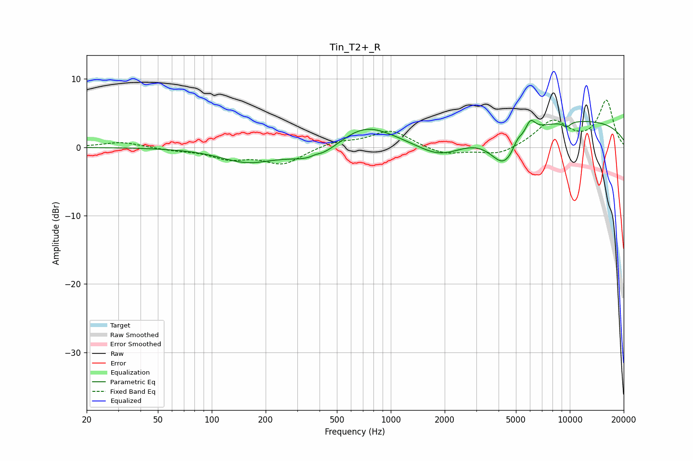

# Tin_T2+_R
See [usage instructions](https://github.com/jaakkopasanen/AutoEq#usage) for more options and info.

### Parametric EQs
Apply preamp of -4.0 dB when using parametric equalizer.

|   # | Type    |   Fc (Hz) |    Q |   Gain (dB) |
|-----|---------|-----------|------|-------------|
|   1 | Peaking |       157 | 0.95 |        -2   |
|   2 | Peaking |       379 | 5.97 |         0.3 |
|   3 | Peaking |       385 | 1.02 |        -2.4 |
|   4 | Peaking |       706 | 0.9  |         3.5 |
|   5 | Peaking |      1904 | 1.02 |        -3.1 |
|   6 | Peaking |      4303 | 1.73 |        -5.4 |
|   7 | Peaking |      5098 | 5.72 |         1   |
|   8 | Peaking |      6020 | 5.13 |         2   |
|   9 | Peaking |      8681 | 0.18 |         4.1 |
|  10 | Peaking |      9614 | 5.87 |        -0.8 |

### Fixed Band EQs
When using fixed band (also called graphic) equalizer, apply preamp of **-7.0 dB** (if available) and set gains manually with these parameters.

|   # | Type    |   Fc (Hz) |    Q |   Gain (dB) |
|-----|---------|-----------|------|-------------|
|   1 | Peaking |        31 | 1.41 |         0.8 |
|   2 | Peaking |        62 | 1.41 |        -0.4 |
|   3 | Peaking |       125 | 1.41 |        -1.5 |
|   4 | Peaking |       250 | 1.41 |        -2.4 |
|   5 | Peaking |       500 | 1.41 |         0.9 |
|   6 | Peaking |      1000 | 1.41 |         2.5 |
|   7 | Peaking |      2000 | 1.41 |        -1.2 |
|   8 | Peaking |      4000 | 1.41 |        -1.2 |
|   9 | Peaking |      8000 | 1.41 |         3.8 |
|  10 | Peaking |     16000 | 1.41 |         6.8 |

### Graphs

