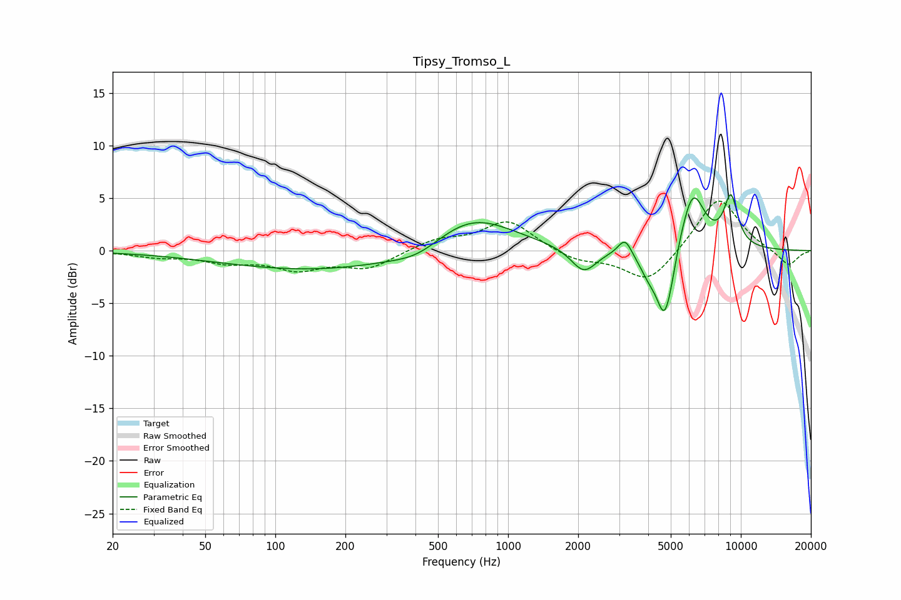

# Tipsy_Tromso_L
See [usage instructions](https://github.com/jaakkopasanen/AutoEq#usage) for more options and info.

### Parametric EQs
Apply preamp of -5.4 dB when using parametric equalizer.

|   # | Type    |   Fc (Hz) |    Q |   Gain (dB) |
|-----|---------|-----------|------|-------------|
|   1 | Peaking |       163 | 0.32 |        -1.9 |
|   2 | Peaking |       411 | 1.33 |        -1   |
|   3 | Peaking |       692 | 0.78 |         3.7 |
|   4 | Peaking |      2114 | 2.58 |        -2.4 |
|   5 | Peaking |      3179 | 4.92 |         1.6 |
|   6 | Peaking |      4045 | 3.22 |        -2   |
|   7 | Peaking |      4689 | 4.12 |        -5.7 |
|   8 | Peaking |      5009 | 5.18 |        -1.2 |
|   9 | Peaking |      6213 | 2.62 |         5.7 |
|  10 | Peaking |      9063 | 4.14 |         4.7 |

### Fixed Band EQs
When using fixed band (also called graphic) equalizer, apply preamp of **-4.8 dB** (if available) and set gains manually with these parameters.

|   # | Type    |   Fc (Hz) |    Q |   Gain (dB) |
|-----|---------|-----------|------|-------------|
|   1 | Peaking |        31 | 1.41 |        -0.5 |
|   2 | Peaking |        62 | 1.41 |        -1   |
|   3 | Peaking |       125 | 1.41 |        -1.6 |
|   4 | Peaking |       250 | 1.41 |        -1.6 |
|   5 | Peaking |       500 | 1.41 |         1   |
|   6 | Peaking |      1000 | 1.41 |         2.8 |
|   7 | Peaking |      2000 | 1.41 |        -1   |
|   8 | Peaking |      4000 | 1.41 |        -3.1 |
|   9 | Peaking |      8000 | 1.41 |         5.2 |
|  10 | Peaking |     16000 | 1.41 |        -1.5 |

### Graphs

