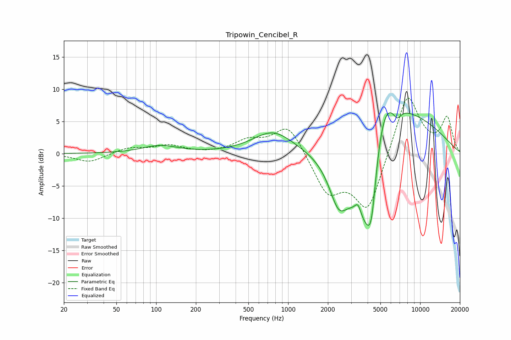

# Tripowin_Cencibel_R
See [usage instructions](https://github.com/jaakkopasanen/AutoEq#usage) for more options and info.

### Parametric EQs
Apply preamp of -6.4 dB when using parametric equalizer.

|   # | Type    |   Fc (Hz) |    Q |   Gain (dB) |
|-----|---------|-----------|------|-------------|
|   1 | Peaking |       107 | 1.07 |         1.2 |
|   2 | Peaking |       769 | 0.94 |         3.4 |
|   3 | Peaking |      2411 | 1.9  |        -6.6 |
|   4 | Peaking |      3381 | 5.99 |         1.8 |
|   5 | Peaking |      3669 | 1.03 |        -8.7 |
|   6 | Peaking |      4101 | 1.67 |       -11.7 |
|   7 | Peaking |      4284 | 4.92 |        -4.1 |
|   8 | Peaking |      5159 | 1.23 |        12.1 |
|   9 | Peaking |      6690 | 4.36 |        -1.6 |
|  10 | Peaking |      7248 | 0.37 |         5.6 |

### Fixed Band EQs
When using fixed band (also called graphic) equalizer, apply preamp of **-8.7 dB** (if available) and set gains manually with these parameters.

|   # | Type    |   Fc (Hz) |    Q |   Gain (dB) |
|-----|---------|-----------|------|-------------|
|   1 | Peaking |        31 | 1.41 |        -1.4 |
|   2 | Peaking |        62 | 1.41 |         0.9 |
|   3 | Peaking |       125 | 1.41 |         1.2 |
|   4 | Peaking |       250 | 1.41 |        -0   |
|   5 | Peaking |       500 | 1.41 |         1.8 |
|   6 | Peaking |      1000 | 1.41 |         4.7 |
|   7 | Peaking |      2000 | 1.41 |        -5.9 |
|   8 | Peaking |      4000 | 1.41 |        -9   |
|   9 | Peaking |      8000 | 1.41 |         9.8 |
|  10 | Peaking |     16000 | 1.41 |         5.3 |

### Graphs

