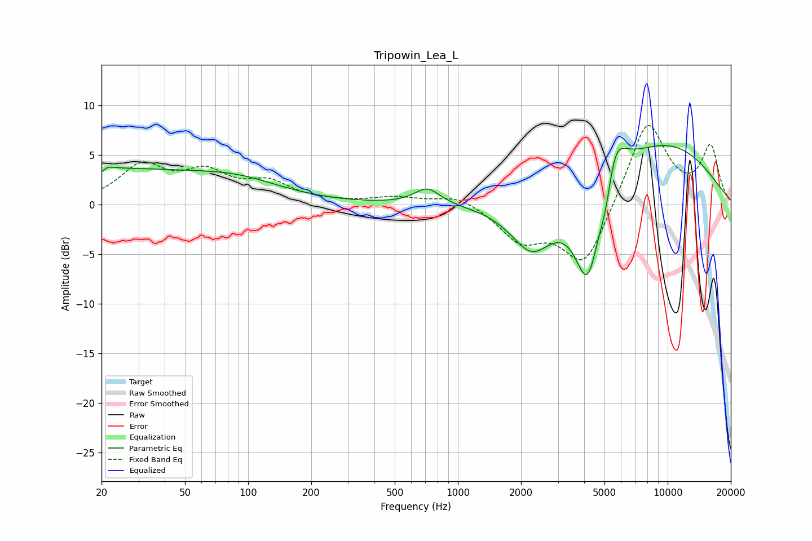

# Tripowin_Lea_L
See [usage instructions](https://github.com/jaakkopasanen/AutoEq#usage) for more options and info.

### Parametric EQs
Apply preamp of -6.0 dB when using parametric equalizer.

|   # | Type    |   Fc (Hz) |    Q |   Gain (dB) |
|-----|---------|-----------|------|-------------|
|   1 | Peaking |        20 | 0.22 |         3.5 |
|   2 | Peaking |        20 | 5.93 |        -3   |
|   3 | Peaking |        20 | 5.11 |         2.7 |
|   4 | Peaking |        94 | 0.72 |         1.2 |
|   5 | Peaking |       714 | 2.29 |         1.7 |
|   6 | Peaking |      2250 | 1.39 |        -5   |
|   7 | Peaking |      4165 | 2.15 |       -10.3 |
|   8 | Peaking |      5112 | 3.98 |        -4   |
|   9 | Peaking |      5457 | 2.4  |         6.8 |
|  10 | Peaking |      9475 | 0.43 |         6.1 |

### Fixed Band EQs
When using fixed band (also called graphic) equalizer, apply preamp of **-8.1 dB** (if available) and set gains manually with these parameters.

|   # | Type    |   Fc (Hz) |    Q |   Gain (dB) |
|-----|---------|-----------|------|-------------|
|   1 | Peaking |        31 | 1.41 |         3.7 |
|   2 | Peaking |        62 | 1.41 |         2.8 |
|   3 | Peaking |       125 | 1.41 |         2   |
|   4 | Peaking |       250 | 1.41 |         0.1 |
|   5 | Peaking |       500 | 1.41 |         0.7 |
|   6 | Peaking |      1000 | 1.41 |         1.1 |
|   7 | Peaking |      2000 | 1.41 |        -3.4 |
|   8 | Peaking |      4000 | 1.41 |        -6.3 |
|   9 | Peaking |      8000 | 1.41 |         8.7 |
|  10 | Peaking |     16000 | 1.41 |         5.7 |

### Graphs

