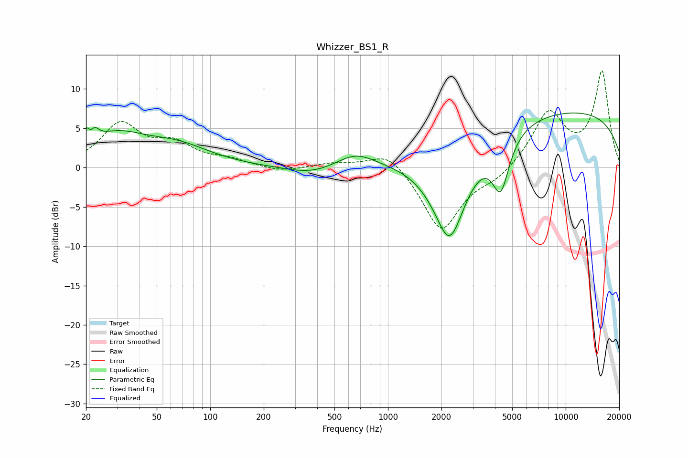

# Whizzer_BS1_R
See [usage instructions](https://github.com/jaakkopasanen/AutoEq#usage) for more options and info.

### Parametric EQs
Apply preamp of -7.0 dB when using parametric equalizer.

|   # | Type    |   Fc (Hz) |    Q |   Gain (dB) |
|-----|---------|-----------|------|-------------|
|   1 | Peaking |        20 | 5.51 |         2.1 |
|   2 | Peaking |        22 | 5.96 |        -2.2 |
|   3 | Peaking |        22 | 5.83 |         2.7 |
|   4 | Peaking |        29 | 0.82 |         3.7 |
|   5 | Peaking |        66 | 0.76 |         2.3 |
|   6 | Peaking |       374 | 0.99 |        -1.1 |
|   7 | Peaking |       657 | 1.29 |         1.9 |
|   8 | Peaking |      2224 | 1.37 |       -12.8 |
|   9 | Peaking |      4313 | 2.92 |        -6.7 |
|  10 | Peaking |      8871 | 0.18 |         7.4 |

### Fixed Band EQs
When using fixed band (also called graphic) equalizer, apply preamp of **-12.4 dB** (if available) and set gains manually with these parameters.

|   # | Type    |   Fc (Hz) |    Q |   Gain (dB) |
|-----|---------|-----------|------|-------------|
|   1 | Peaking |        31 | 1.41 |         5.3 |
|   2 | Peaking |        62 | 1.41 |         2.6 |
|   3 | Peaking |       125 | 1.41 |         0.8 |
|   4 | Peaking |       250 | 1.41 |        -0.6 |
|   5 | Peaking |       500 | 1.41 |         0.5 |
|   6 | Peaking |      1000 | 1.41 |         2.4 |
|   7 | Peaking |      2000 | 1.41 |        -8.1 |
|   8 | Peaking |      4000 | 1.41 |        -1.3 |
|   9 | Peaking |      8000 | 1.41 |         6.9 |
|  10 | Peaking |     16000 | 1.41 |        12   |

### Graphs

