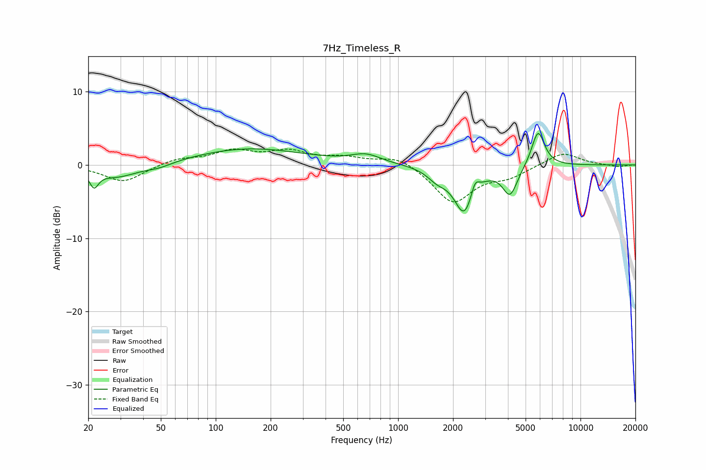

# 7Hz_Timeless_R
See [usage instructions](https://github.com/jaakkopasanen/AutoEq#usage) for more options and info.

### Parametric EQs
Apply preamp of -4.4 dB when using parametric equalizer.

|   # | Type    |   Fc (Hz) |    Q |   Gain (dB) |
|-----|---------|-----------|------|-------------|
|   1 | Peaking |        21 | 5.89 |        -2.1 |
|   2 | Peaking |        29 | 1.18 |        -1.8 |
|   3 | Peaking |        49 | 1.89 |        -0.6 |
|   4 | Peaking |       153 | 0.47 |         2.2 |
|   5 | Peaking |       667 | 1.75 |         1.2 |
|   6 | Peaking |      1636 | 2.64 |        -1.3 |
|   7 | Peaking |      2313 | 2.5  |        -6.5 |
|   8 | Peaking |      2635 | 6    |         2.1 |
|   9 | Peaking |      4111 | 3.45 |        -3.9 |
|  10 | Peaking |      5852 | 3.87 |         5   |

### Fixed Band EQs
When using fixed band (also called graphic) equalizer, apply preamp of **-2.3 dB** (if available) and set gains manually with these parameters.

|   # | Type    |   Fc (Hz) |    Q |   Gain (dB) |
|-----|---------|-----------|------|-------------|
|   1 | Peaking |        31 | 1.41 |        -2.4 |
|   2 | Peaking |        62 | 1.41 |         0.8 |
|   3 | Peaking |       125 | 1.41 |         1.8 |
|   4 | Peaking |       250 | 1.41 |         1.7 |
|   5 | Peaking |       500 | 1.41 |         0.9 |
|   6 | Peaking |      1000 | 1.41 |         1.3 |
|   7 | Peaking |      2000 | 1.41 |        -5.1 |
|   8 | Peaking |      4000 | 1.41 |        -1.4 |
|   9 | Peaking |      8000 | 1.41 |         1.8 |
|  10 | Peaking |     16000 | 1.41 |        -0.3 |

### Graphs

