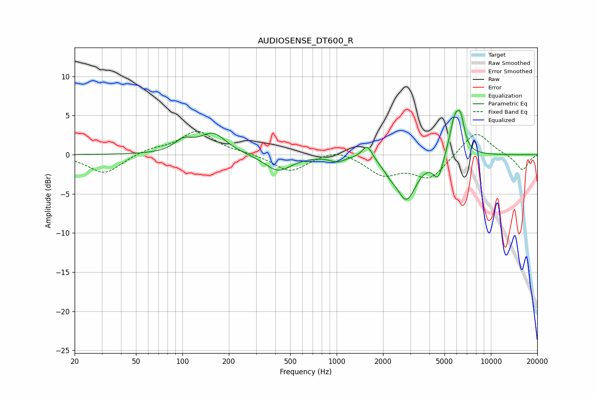

# AUDIOSENSE_DT600_R
See [usage instructions](https://github.com/jaakkopasanen/AutoEq#usage) for more options and info.

### Parametric EQs
Apply preamp of -5.7 dB when using parametric equalizer.

|   # | Type    |   Fc (Hz) |    Q |   Gain (dB) |
|-----|---------|-----------|------|-------------|
|   1 | Peaking |       102 | 2.39 |         1.4 |
|   2 | Peaking |       158 | 1.64 |         2.6 |
|   3 | Peaking |       417 | 1.64 |        -2.1 |
|   4 | Peaking |      1008 | 3.07 |        -0.7 |
|   5 | Peaking |      1578 | 4.26 |         1.9 |
|   6 | Peaking |      2214 | 3.18 |        -0.9 |
|   7 | Peaking |      2838 | 2.18 |        -5.5 |
|   8 | Peaking |      4553 | 4.34 |        -2.8 |
|   9 | Peaking |      5855 | 3.87 |         4.8 |
|  10 | Peaking |      6389 | 5.79 |         2.9 |

### Fixed Band EQs
When using fixed band (also called graphic) equalizer, apply preamp of **-3.1 dB** (if available) and set gains manually with these parameters.

|   # | Type    |   Fc (Hz) |    Q |   Gain (dB) |
|-----|---------|-----------|------|-------------|
|   1 | Peaking |        31 | 1.41 |        -2.5 |
|   2 | Peaking |        62 | 1.41 |         0.7 |
|   3 | Peaking |       125 | 1.41 |         3   |
|   4 | Peaking |       250 | 1.41 |         0.2 |
|   5 | Peaking |       500 | 1.41 |        -2.2 |
|   6 | Peaking |      1000 | 1.41 |         0.9 |
|   7 | Peaking |      2000 | 1.41 |        -2.4 |
|   8 | Peaking |      4000 | 1.41 |        -3   |
|   9 | Peaking |      8000 | 1.41 |         3.2 |
|  10 | Peaking |     16000 | 1.41 |        -2   |

### Graphs

