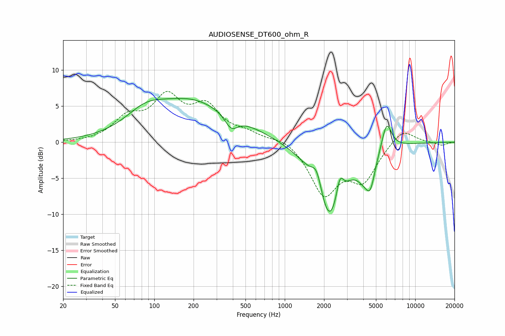

# AUDIOSENSE_DT600_ohm_R
See [usage instructions](https://github.com/jaakkopasanen/AutoEq#usage) for more options and info.

### Parametric EQs
Apply preamp of -6.2 dB when using parametric equalizer.

|   # | Type    |   Fc (Hz) |    Q |   Gain (dB) |
|-----|---------|-----------|------|-------------|
|   1 | Peaking |        85 | 0.96 |         2.4 |
|   2 | Peaking |       214 | 0.45 |         6   |
|   3 | Peaking |       271 | 0.93 |        -0.6 |
|   4 | Peaking |       389 | 2.78 |        -2   |
|   5 | Peaking |      1762 | 3.45 |         3.2 |
|   6 | Peaking |      2194 | 1.39 |       -11.2 |
|   7 | Peaking |      2646 | 5.19 |         3.1 |
|   8 | Peaking |      3997 | 2.72 |        -1.9 |
|   9 | Peaking |      4531 | 3.73 |        -4.1 |
|  10 | Peaking |      6041 | 3.57 |         4   |

### Fixed Band EQs
When using fixed band (also called graphic) equalizer, apply preamp of **-7.1 dB** (if available) and set gains manually with these parameters.

|   # | Type    |   Fc (Hz) |    Q |   Gain (dB) |
|-----|---------|-----------|------|-------------|
|   1 | Peaking |        31 | 1.41 |        -0   |
|   2 | Peaking |        62 | 1.41 |         3   |
|   3 | Peaking |       125 | 1.41 |         5.6 |
|   4 | Peaking |       250 | 1.41 |         4.4 |
|   5 | Peaking |       500 | 1.41 |         1   |
|   6 | Peaking |      1000 | 1.41 |         0.8 |
|   7 | Peaking |      2000 | 1.41 |        -7   |
|   8 | Peaking |      4000 | 1.41 |        -4.8 |
|   9 | Peaking |      8000 | 1.41 |         2.1 |
|  10 | Peaking |     16000 | 1.41 |        -0.5 |

### Graphs

