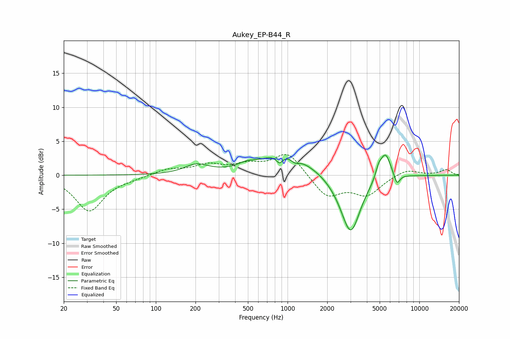

# Aukey_EP-B44_R
See [usage instructions](https://github.com/jaakkopasanen/AutoEq#usage) for more options and info.

### Parametric EQs
Apply preamp of -3.0 dB when using parametric equalizer.

|   # | Type    |   Fc (Hz) |    Q |   Gain (dB) |
|-----|---------|-----------|------|-------------|
|   1 | Peaking |       204 | 1.56 |         1.4 |
|   2 | Peaking |       485 | 2.47 |         0.5 |
|   3 | Peaking |       867 | 6    |        -1.1 |
|   4 | Peaking |       953 | 0.72 |         3.3 |
|   5 | Peaking |      1137 | 4.43 |        -0.7 |
|   6 | Peaking |      2702 | 1.23 |        -1.1 |
|   7 | Peaking |      3021 | 1.98 |        -7.8 |
|   8 | Peaking |      4913 | 5.99 |         1.4 |
|   9 | Peaking |      5533 | 3.42 |         3.8 |
|  10 | Peaking |      6764 | 6    |        -1.6 |

### Fixed Band EQs
When using fixed band (also called graphic) equalizer, apply preamp of **-3.1 dB** (if available) and set gains manually with these parameters.

|   # | Type    |   Fc (Hz) |    Q |   Gain (dB) |
|-----|---------|-----------|------|-------------|
|   1 | Peaking |        31 | 1.41 |        -5.2 |
|   2 | Peaking |        62 | 1.41 |        -0.3 |
|   3 | Peaking |       125 | 1.41 |         0.9 |
|   4 | Peaking |       250 | 1.41 |         1.4 |
|   5 | Peaking |       500 | 1.41 |         1.3 |
|   6 | Peaking |      1000 | 1.41 |         3.4 |
|   7 | Peaking |      2000 | 1.41 |        -3.2 |
|   8 | Peaking |      4000 | 1.41 |        -2.8 |
|   9 | Peaking |      8000 | 1.41 |         1   |
|  10 | Peaking |     16000 | 1.41 |         0.8 |

### Graphs

