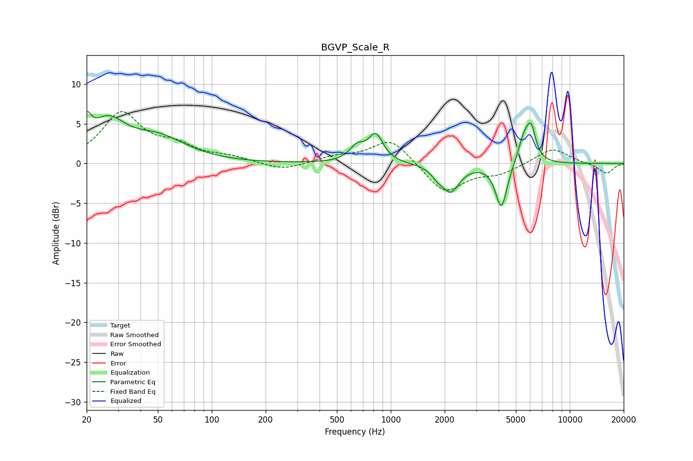

# BGVP_Scale_R
See [usage instructions](https://github.com/jaakkopasanen/AutoEq#usage) for more options and info.

### Parametric EQs
Apply preamp of -6.6 dB when using parametric equalizer.

|   # | Type    |   Fc (Hz) |    Q |   Gain (dB) |
|-----|---------|-----------|------|-------------|
|   1 | Peaking |        20 | 5.84 |         3   |
|   2 | Peaking |        26 | 1.42 |         4.6 |
|   3 | Peaking |        50 | 0.9  |         2.9 |
|   4 | Peaking |       646 | 3.43 |         1.7 |
|   5 | Peaking |       825 | 3.44 |         3.4 |
|   6 | Peaking |      1817 | 4.62 |        -0.8 |
|   7 | Peaking |      2159 | 2.87 |        -3.4 |
|   8 | Peaking |      4146 | 4.36 |        -5.7 |
|   9 | Peaking |      5548 | 4.1  |         3.1 |
|  10 | Peaking |      6083 | 5.26 |         3.7 |

### Fixed Band EQs
When using fixed band (also called graphic) equalizer, apply preamp of **-6.6 dB** (if available) and set gains manually with these parameters.

|   # | Type    |   Fc (Hz) |    Q |   Gain (dB) |
|-----|---------|-----------|------|-------------|
|   1 | Peaking |        31 | 1.41 |         6.2 |
|   2 | Peaking |        62 | 1.41 |         1.8 |
|   3 | Peaking |       125 | 1.41 |         0.7 |
|   4 | Peaking |       250 | 1.41 |        -0.9 |
|   5 | Peaking |       500 | 1.41 |         0.8 |
|   6 | Peaking |      1000 | 1.41 |         3.2 |
|   7 | Peaking |      2000 | 1.41 |        -3.8 |
|   8 | Peaking |      4000 | 1.41 |        -1.2 |
|   9 | Peaking |      8000 | 1.41 |         2   |
|  10 | Peaking |     16000 | 1.41 |        -1.3 |

### Graphs

