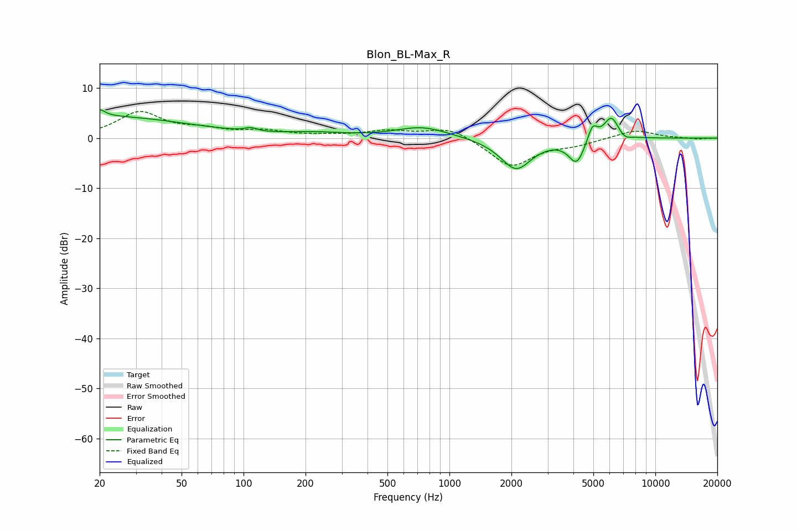

# Blon_BL-Max_R
See [usage instructions](https://github.com/jaakkopasanen/AutoEq#usage) for more options and info.

### Parametric EQs
Apply preamp of -5.7 dB when using parametric equalizer.

|   # | Type    |   Fc (Hz) |    Q |   Gain (dB) |
|-----|---------|-----------|------|-------------|
|   1 | Peaking |        20 | 5.44 |         1.3 |
|   2 | Peaking |        20 | 0.32 |         4.3 |
|   3 | Peaking |       108 | 5.05 |         0.7 |
|   4 | Peaking |       223 | 0.96 |         0.8 |
|   5 | Peaking |       738 | 1.11 |         2.2 |
|   6 | Peaking |      2106 | 1.86 |        -6.2 |
|   7 | Peaking |      4148 | 3.63 |        -4.8 |
|   8 | Peaking |      4954 | 5.89 |         3.3 |
|   9 | Peaking |      6117 | 3.74 |         4.5 |
|  10 | Peaking |      7080 | 4.64 |        -1   |

### Fixed Band EQs
When using fixed band (also called graphic) equalizer, apply preamp of **-5.4 dB** (if available) and set gains manually with these parameters.

|   # | Type    |   Fc (Hz) |    Q |   Gain (dB) |
|-----|---------|-----------|------|-------------|
|   1 | Peaking |        31 | 1.41 |         5   |
|   2 | Peaking |        62 | 1.41 |         1.4 |
|   3 | Peaking |       125 | 1.41 |         1.2 |
|   4 | Peaking |       250 | 1.41 |         0.3 |
|   5 | Peaking |       500 | 1.41 |         1.3 |
|   6 | Peaking |      1000 | 1.41 |         2.2 |
|   7 | Peaking |      2000 | 1.41 |        -5.7 |
|   8 | Peaking |      4000 | 1.41 |        -1.1 |
|   9 | Peaking |      8000 | 1.41 |         1.7 |
|  10 | Peaking |     16000 | 1.41 |        -0.2 |

### Graphs

