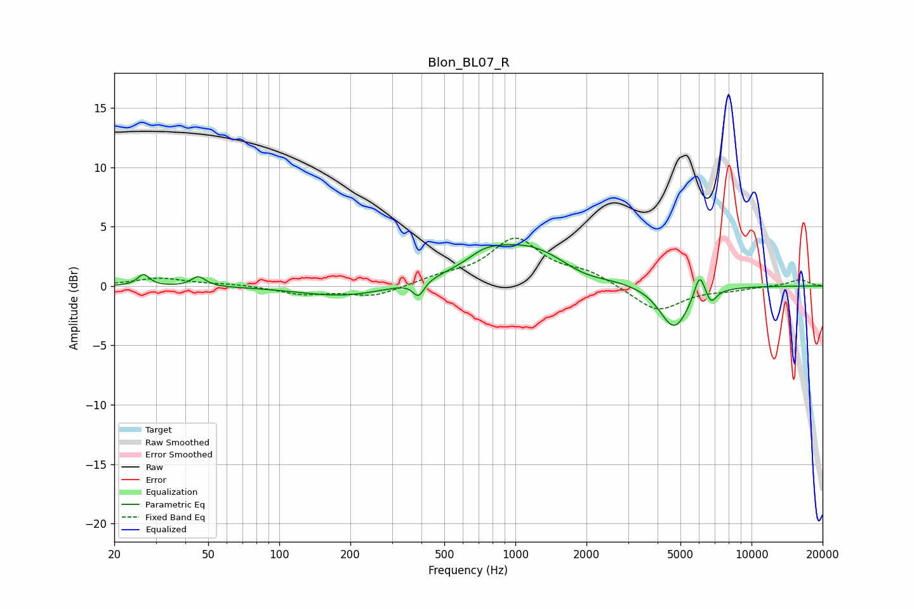

# Blon_BL07_R
See [usage instructions](https://github.com/jaakkopasanen/AutoEq#usage) for more options and info.

### Parametric EQs
Apply preamp of -3.6 dB when using parametric equalizer.

|   # | Type    |   Fc (Hz) |    Q |   Gain (dB) |
|-----|---------|-----------|------|-------------|
|   1 | Peaking |        27 | 5.81 |         1   |
|   2 | Peaking |        45 | 4.85 |         0.8 |
|   3 | Peaking |       190 | 0.76 |        -0.9 |
|   4 | Peaking |       389 | 6    |        -1.3 |
|   5 | Peaking |       742 | 1.93 |         0.9 |
|   6 | Peaking |      1117 | 0.73 |         3.4 |
|   7 | Peaking |      1922 | 1.41 |        -0.7 |
|   8 | Peaking |      4704 | 2.24 |        -3.7 |
|   9 | Peaking |      6030 | 6    |         2.2 |
|  10 | Peaking |      6740 | 6    |        -1.1 |

### Fixed Band EQs
When using fixed band (also called graphic) equalizer, apply preamp of **-4.1 dB** (if available) and set gains manually with these parameters.

|   # | Type    |   Fc (Hz) |    Q |   Gain (dB) |
|-----|---------|-----------|------|-------------|
|   1 | Peaking |        31 | 1.41 |         0.7 |
|   2 | Peaking |        62 | 1.41 |         0.2 |
|   3 | Peaking |       125 | 1.41 |        -0.7 |
|   4 | Peaking |       250 | 1.41 |        -0.9 |
|   5 | Peaking |       500 | 1.41 |         0.6 |
|   6 | Peaking |      1000 | 1.41 |         3.8 |
|   7 | Peaking |      2000 | 1.41 |         1   |
|   8 | Peaking |      4000 | 1.41 |        -2.2 |
|   9 | Peaking |      8000 | 1.41 |        -0.3 |
|  10 | Peaking |     16000 | 1.41 |         0.6 |

### Graphs

