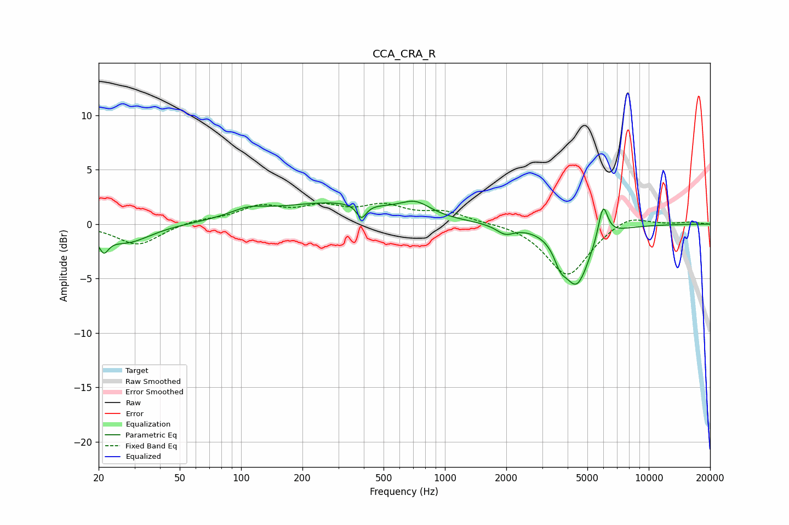

# CCA_CRA_R
See [usage instructions](https://github.com/jaakkopasanen/AutoEq#usage) for more options and info.

### Parametric EQs
Apply preamp of -2.2 dB when using parametric equalizer.

|   # | Type    |   Fc (Hz) |    Q |   Gain (dB) |
|-----|---------|-----------|------|-------------|
|   1 | Peaking |        21 | 5.98 |        -1.5 |
|   2 | Peaking |        28 | 1.22 |        -1.7 |
|   3 | Peaking |       108 | 1.57 |         0.8 |
|   4 | Peaking |       286 | 0.47 |         1.9 |
|   5 | Peaking |       389 | 6    |        -1.3 |
|   6 | Peaking |       717 | 1.96 |         1.2 |
|   7 | Peaking |      1976 | 3.26 |        -0.8 |
|   8 | Peaking |      3681 | 4.72 |        -1.4 |
|   9 | Peaking |      4427 | 2.17 |        -5.4 |
|  10 | Peaking |      5968 | 5.89 |         3.2 |

### Fixed Band EQs
When using fixed band (also called graphic) equalizer, apply preamp of **-2.0 dB** (if available) and set gains manually with these parameters.

|   # | Type    |   Fc (Hz) |    Q |   Gain (dB) |
|-----|---------|-----------|------|-------------|
|   1 | Peaking |        31 | 1.41 |        -2   |
|   2 | Peaking |        62 | 1.41 |         0.4 |
|   3 | Peaking |       125 | 1.41 |         1.5 |
|   4 | Peaking |       250 | 1.41 |         1.3 |
|   5 | Peaking |       500 | 1.41 |         1.5 |
|   6 | Peaking |      1000 | 1.41 |         1   |
|   7 | Peaking |      2000 | 1.41 |         0.1 |
|   8 | Peaking |      4000 | 1.41 |        -4.8 |
|   9 | Peaking |      8000 | 1.41 |         1   |
|  10 | Peaking |     16000 | 1.41 |         0.2 |

### Graphs

