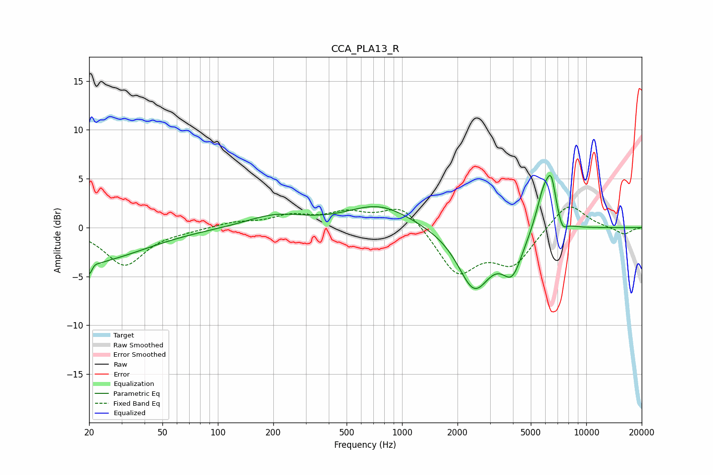

# CCA_PLA13_R
See [usage instructions](https://github.com/jaakkopasanen/AutoEq#usage) for more options and info.

### Parametric EQs
Apply preamp of -5.4 dB when using parametric equalizer.

|   # | Type    |   Fc (Hz) |    Q |   Gain (dB) |
|-----|---------|-----------|------|-------------|
|   1 | Peaking |        20 | 0.49 |        -3.5 |
|   2 | Peaking |        20 | 5.47 |        -3.3 |
|   3 | Peaking |        21 | 6    |         2.3 |
|   4 | Peaking |       205 | 0.91 |         1.2 |
|   5 | Peaking |       752 | 0.83 |         2.3 |
|   6 | Peaking |      2466 | 1.58 |        -6.1 |
|   7 | Peaking |      3968 | 2.49 |        -3.9 |
|   8 | Peaking |      5883 | 3.2  |         4.1 |
|   9 | Peaking |      6470 | 5.36 |         3.5 |
|  10 | Peaking |      7413 | 5.73 |        -1.1 |

### Fixed Band EQs
When using fixed band (also called graphic) equalizer, apply preamp of **-2.2 dB** (if available) and set gains manually with these parameters.

|   # | Type    |   Fc (Hz) |    Q |   Gain (dB) |
|-----|---------|-----------|------|-------------|
|   1 | Peaking |        31 | 1.41 |        -3.8 |
|   2 | Peaking |        62 | 1.41 |        -0.2 |
|   3 | Peaking |       125 | 1.41 |         0.5 |
|   4 | Peaking |       250 | 1.41 |         1.1 |
|   5 | Peaking |       500 | 1.41 |         1.3 |
|   6 | Peaking |      1000 | 1.41 |         2.4 |
|   7 | Peaking |      2000 | 1.41 |        -4.6 |
|   8 | Peaking |      4000 | 1.41 |        -3.6 |
|   9 | Peaking |      8000 | 1.41 |         2.7 |
|  10 | Peaking |     16000 | 1.41 |        -0.7 |

### Graphs

