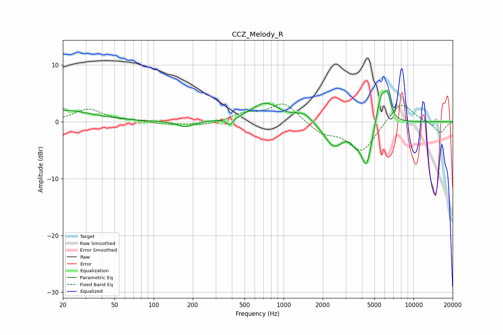

# CCZ_Melody_R
See [usage instructions](https://github.com/jaakkopasanen/AutoEq#usage) for more options and info.

### Parametric EQs
Apply preamp of -5.6 dB when using parametric equalizer.

|   # | Type    |   Fc (Hz) |    Q |   Gain (dB) |
|-----|---------|-----------|------|-------------|
|   1 | Peaking |        20 | 0.65 |         2   |
|   2 | Peaking |       174 | 2.34 |        -1   |
|   3 | Peaking |       387 | 5.85 |        -1.2 |
|   4 | Peaking |       724 | 1.32 |         3.3 |
|   5 | Peaking |      1437 | 2.03 |         1.6 |
|   6 | Peaking |      2433 | 1.81 |        -4.2 |
|   7 | Peaking |      3505 | 5.6  |        -1.1 |
|   8 | Peaking |      4335 | 3.13 |        -7.9 |
|   9 | Peaking |      5615 | 3.48 |         5.6 |
|  10 | Peaking |      6289 | 5.47 |         3.5 |

### Fixed Band EQs
When using fixed band (also called graphic) equalizer, apply preamp of **-3.2 dB** (if available) and set gains manually with these parameters.

|   # | Type    |   Fc (Hz) |    Q |   Gain (dB) |
|-----|---------|-----------|------|-------------|
|   1 | Peaking |        31 | 1.41 |         2.2 |
|   2 | Peaking |        62 | 1.41 |         0.2 |
|   3 | Peaking |       125 | 1.41 |        -0.5 |
|   4 | Peaking |       250 | 1.41 |        -0.6 |
|   5 | Peaking |       500 | 1.41 |         1.3 |
|   6 | Peaking |      1000 | 1.41 |         3.4 |
|   7 | Peaking |      2000 | 1.41 |        -1.9 |
|   8 | Peaking |      4000 | 1.41 |        -5.3 |
|   9 | Peaking |      8000 | 1.41 |         3.8 |
|  10 | Peaking |     16000 | 1.41 |        -2   |

### Graphs

