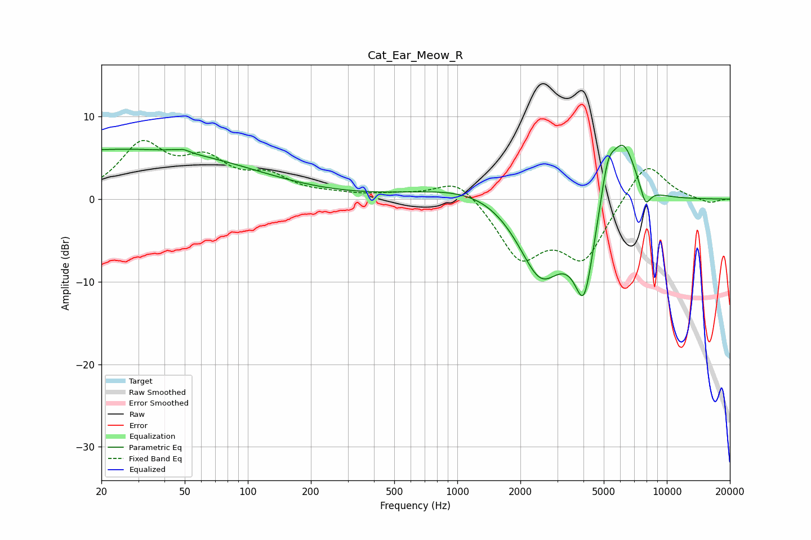

# Cat_Ear_Meow_R
See [usage instructions](https://github.com/jaakkopasanen/AutoEq#usage) for more options and info.

### Parametric EQs
Apply preamp of -6.6 dB when using parametric equalizer.

|   # | Type    |   Fc (Hz) |    Q |   Gain (dB) |
|-----|---------|-----------|------|-------------|
|   1 | Peaking |        20 | 0.21 |         5.7 |
|   2 | Peaking |        47 | 5.81 |        -2.9 |
|   3 | Peaking |        47 | 5.37 |         3.2 |
|   4 | Peaking |        81 | 0.42 |         0.8 |
|   5 | Peaking |      1661 | 0.51 |         3.6 |
|   6 | Peaking |      2496 | 1.07 |       -11.8 |
|   7 | Peaking |      4031 | 2.82 |       -10.3 |
|   8 | Peaking |      5213 | 3.91 |         4.7 |
|   9 | Peaking |      6173 | 2.04 |         7.9 |
|  10 | Peaking |      7896 | 5.17 |        -2.6 |

### Fixed Band EQs
When using fixed band (also called graphic) equalizer, apply preamp of **-7.2 dB** (if available) and set gains manually with these parameters.

|   # | Type    |   Fc (Hz) |    Q |   Gain (dB) |
|-----|---------|-----------|------|-------------|
|   1 | Peaking |        31 | 1.41 |         6.2 |
|   2 | Peaking |        62 | 1.41 |         4   |
|   3 | Peaking |       125 | 1.41 |         2.4 |
|   4 | Peaking |       250 | 1.41 |         0.4 |
|   5 | Peaking |       500 | 1.41 |         0.4 |
|   6 | Peaking |      1000 | 1.41 |         2.8 |
|   7 | Peaking |      2000 | 1.41 |        -6.8 |
|   8 | Peaking |      4000 | 1.41 |        -7   |
|   9 | Peaking |      8000 | 1.41 |         4.9 |
|  10 | Peaking |     16000 | 1.41 |        -0.6 |

### Graphs

