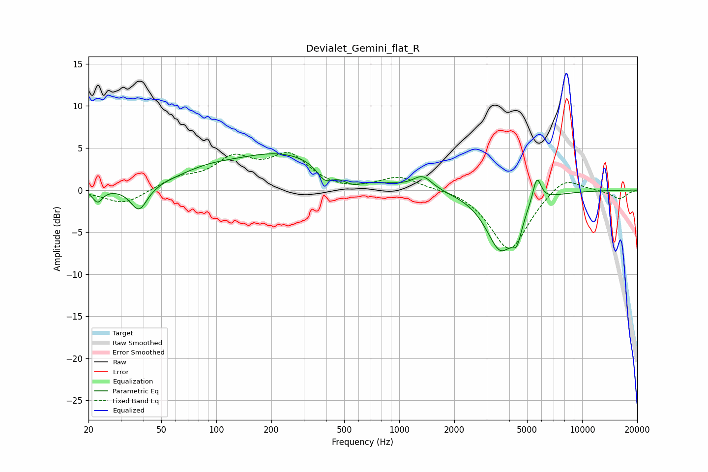

# Devialet_Gemini_flat_R
See [usage instructions](https://github.com/jaakkopasanen/AutoEq#usage) for more options and info.

### Parametric EQs
Apply preamp of -4.4 dB when using parametric equalizer.

|   # | Type    |   Fc (Hz) |    Q |   Gain (dB) |
|-----|---------|-----------|------|-------------|
|   1 | Peaking |        22 | 5.55 |        -1.5 |
|   2 | Peaking |        38 | 3.13 |        -3   |
|   3 | Peaking |        87 | 0.87 |         1.3 |
|   4 | Peaking |       232 | 0.5  |         4.2 |
|   5 | Peaking |       392 | 3.3  |        -1.7 |
|   6 | Peaking |       554 | 2.34 |        -1.2 |
|   7 | Peaking |      1343 | 2.75 |         1.6 |
|   8 | Peaking |      3584 | 1.75 |        -7   |
|   9 | Peaking |      4403 | 5.3  |        -2.6 |
|  10 | Peaking |      5656 | 5.9  |         3.2 |

### Fixed Band EQs
When using fixed band (also called graphic) equalizer, apply preamp of **-4.6 dB** (if available) and set gains manually with these parameters.

|   # | Type    |   Fc (Hz) |    Q |   Gain (dB) |
|-----|---------|-----------|------|-------------|
|   1 | Peaking |        31 | 1.41 |        -1.8 |
|   2 | Peaking |        62 | 1.41 |         1.2 |
|   3 | Peaking |       125 | 1.41 |         3.4 |
|   4 | Peaking |       250 | 1.41 |         3.8 |
|   5 | Peaking |       500 | 1.41 |        -0.3 |
|   6 | Peaking |      1000 | 1.41 |         1.6 |
|   7 | Peaking |      2000 | 1.41 |         0.3 |
|   8 | Peaking |      4000 | 1.41 |        -7.3 |
|   9 | Peaking |      8000 | 1.41 |         1.9 |
|  10 | Peaking |     16000 | 1.41 |        -1.1 |

### Graphs

