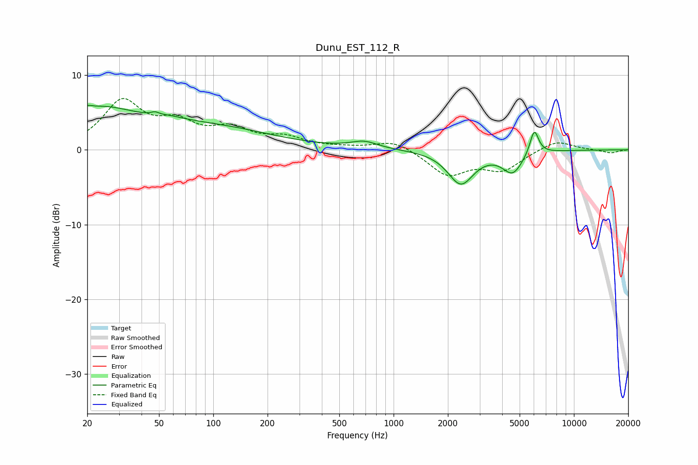

# Dunu_EST_112_R
See [usage instructions](https://github.com/jaakkopasanen/AutoEq#usage) for more options and info.

### Parametric EQs
Apply preamp of -6.0 dB when using parametric equalizer.

|   # | Type    |   Fc (Hz) |    Q |   Gain (dB) |
|-----|---------|-----------|------|-------------|
|   1 | Peaking |        20 | 5.76 |         0.5 |
|   2 | Peaking |        22 | 0.65 |         4.8 |
|   3 | Peaking |        48 | 5.84 |        -2.7 |
|   4 | Peaking |        48 | 5.98 |         3   |
|   5 | Peaking |        57 | 1.7  |         0.5 |
|   6 | Peaking |        93 | 0.4  |         2.9 |
|   7 | Peaking |       687 | 1.91 |         0.9 |
|   8 | Peaking |      2358 | 1.98 |        -4.5 |
|   9 | Peaking |      4573 | 2.52 |        -2.9 |
|  10 | Peaking |      6026 | 5.64 |         3.4 |

### Fixed Band EQs
When using fixed band (also called graphic) equalizer, apply preamp of **-7.0 dB** (if available) and set gains manually with these parameters.

|   # | Type    |   Fc (Hz) |    Q |   Gain (dB) |
|-----|---------|-----------|------|-------------|
|   1 | Peaking |        31 | 1.41 |         6.2 |
|   2 | Peaking |        62 | 1.41 |         3   |
|   3 | Peaking |       125 | 1.41 |         2.4 |
|   4 | Peaking |       250 | 1.41 |         1.4 |
|   5 | Peaking |       500 | 1.41 |         0.2 |
|   6 | Peaking |      1000 | 1.41 |         1.3 |
|   7 | Peaking |      2000 | 1.41 |        -3.3 |
|   8 | Peaking |      4000 | 1.41 |        -2.5 |
|   9 | Peaking |      8000 | 1.41 |         1.4 |
|  10 | Peaking |     16000 | 1.41 |        -0.4 |

### Graphs

