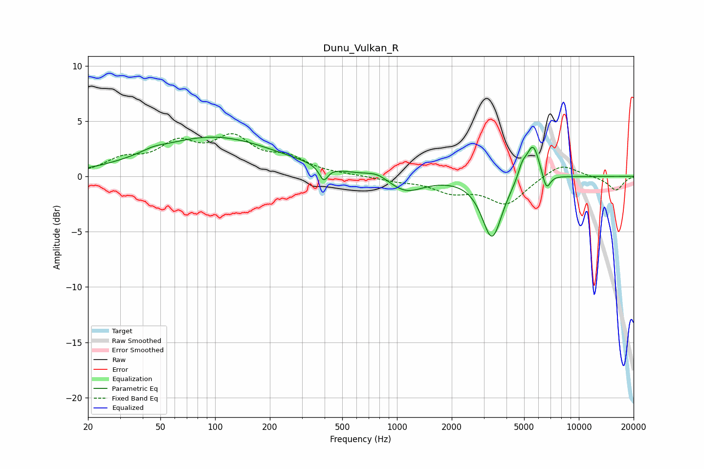

# Dunu_Vulkan_R
See [usage instructions](https://github.com/jaakkopasanen/AutoEq#usage) for more options and info.

### Parametric EQs
Apply preamp of -3.6 dB when using parametric equalizer.

|   # | Type    |   Fc (Hz) |    Q |   Gain (dB) |
|-----|---------|-----------|------|-------------|
|   1 | Peaking |        46 | 2.4  |         0.3 |
|   2 | Peaking |        98 | 0.41 |         3.5 |
|   3 | Peaking |       275 | 3.44 |         0   |
|   4 | Peaking |       395 | 6    |        -1.3 |
|   5 | Peaking |       778 | 2.38 |         0.5 |
|   6 | Peaking |      1118 | 1.45 |        -1.4 |
|   7 | Peaking |      3332 | 2.55 |        -5.5 |
|   8 | Peaking |      4882 | 6    |         1.1 |
|   9 | Peaking |      5596 | 3.74 |         3.2 |
|  10 | Peaking |      6622 | 5.99 |        -1.6 |

### Fixed Band EQs
When using fixed band (also called graphic) equalizer, apply preamp of **-4.0 dB** (if available) and set gains manually with these parameters.

|   # | Type    |   Fc (Hz) |    Q |   Gain (dB) |
|-----|---------|-----------|------|-------------|
|   1 | Peaking |        31 | 1.41 |         1.3 |
|   2 | Peaking |        62 | 1.41 |         2.6 |
|   3 | Peaking |       125 | 1.41 |         3.1 |
|   4 | Peaking |       250 | 1.41 |         1.4 |
|   5 | Peaking |       500 | 1.41 |         0.1 |
|   6 | Peaking |      1000 | 1.41 |        -0.3 |
|   7 | Peaking |      2000 | 1.41 |        -1.2 |
|   8 | Peaking |      4000 | 1.41 |        -2.4 |
|   9 | Peaking |      8000 | 1.41 |         1.3 |
|  10 | Peaking |     16000 | 1.41 |        -1.3 |

### Graphs

