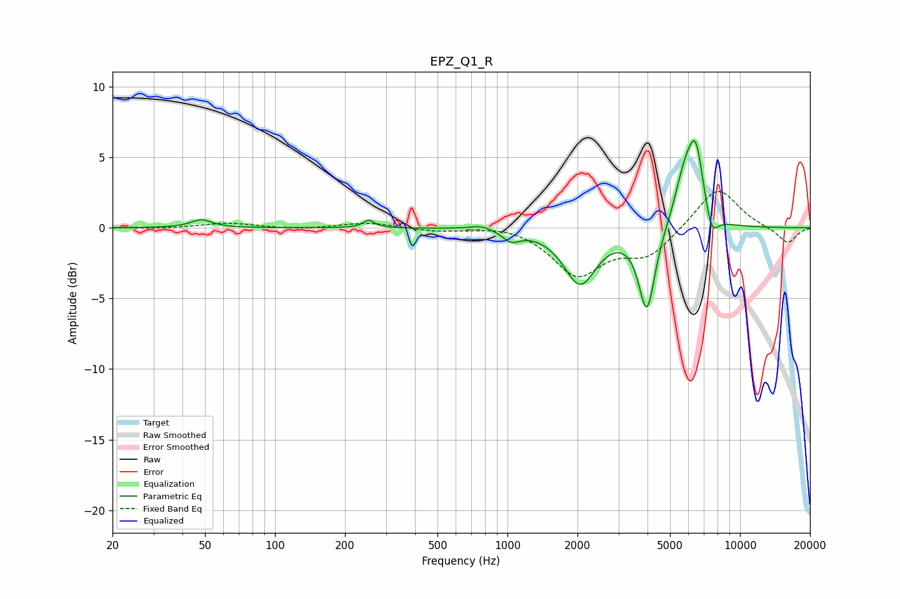

# EPZ_Q1_R
See [usage instructions](https://github.com/jaakkopasanen/AutoEq#usage) for more options and info.

### Parametric EQs
Apply preamp of -6.3 dB when using parametric equalizer.

|   # | Type    |   Fc (Hz) |    Q |   Gain (dB) |
|-----|---------|-----------|------|-------------|
|   1 | Peaking |        48 | 3.2  |         0.6 |
|   2 | Peaking |       253 | 5.99 |         0.5 |
|   3 | Peaking |       766 | 3.39 |         0.1 |
|   4 | Peaking |       774 | 2.57 |         0.3 |
|   5 | Peaking |      1037 | 3.83 |        -0.7 |
|   6 | Peaking |      2053 | 2.04 |        -3.9 |
|   7 | Peaking |      3978 | 4.01 |        -5.9 |
|   8 | Peaking |      5782 | 3.05 |         3.4 |
|   9 | Peaking |      6461 | 4.1  |         4.7 |
|  10 | Peaking |      7551 | 4.89 |        -1.7 |

### Fixed Band EQs
When using fixed band (also called graphic) equalizer, apply preamp of **-2.7 dB** (if available) and set gains manually with these parameters.

|   # | Type    |   Fc (Hz) |    Q |   Gain (dB) |
|-----|---------|-----------|------|-------------|
|   1 | Peaking |        31 | 1.41 |        -0.1 |
|   2 | Peaking |        62 | 1.41 |         0.3 |
|   3 | Peaking |       125 | 1.41 |        -0.1 |
|   4 | Peaking |       250 | 1.41 |         0.4 |
|   5 | Peaking |       500 | 1.41 |        -0.2 |
|   6 | Peaking |      1000 | 1.41 |         0.3 |
|   7 | Peaking |      2000 | 1.41 |        -3.3 |
|   8 | Peaking |      4000 | 1.41 |        -1.9 |
|   9 | Peaking |      8000 | 1.41 |         3   |
|  10 | Peaking |     16000 | 1.41 |        -1.1 |

### Graphs

