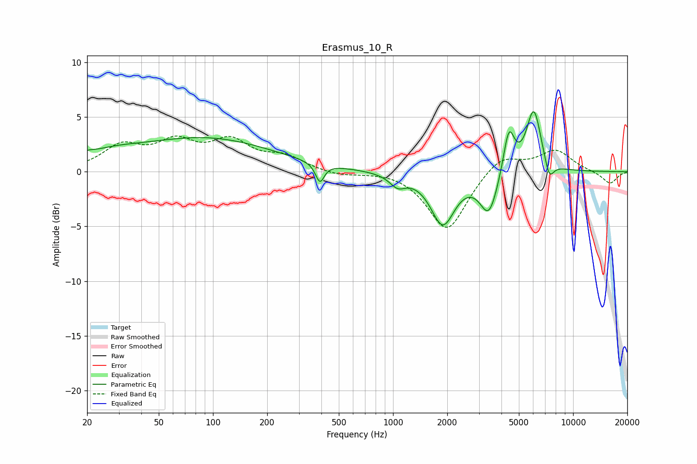

# Erasmus_10_R
See [usage instructions](https://github.com/jaakkopasanen/AutoEq#usage) for more options and info.

### Parametric EQs
Apply preamp of -5.6 dB when using parametric equalizer.

|   # | Type    |   Fc (Hz) |    Q |   Gain (dB) |
|-----|---------|-----------|------|-------------|
|   1 | Peaking |        20 | 3.94 |         0.3 |
|   2 | Peaking |        27 | 0.82 |         1   |
|   3 | Peaking |        92 | 0.38 |         3   |
|   4 | Peaking |       393 | 5.94 |        -1.7 |
|   5 | Peaking |      1060 | 3.21 |        -1.1 |
|   6 | Peaking |      1889 | 2.13 |        -4.7 |
|   7 | Peaking |      3411 | 2.84 |        -3.8 |
|   8 | Peaking |      4400 | 4.55 |         4.1 |
|   9 | Peaking |      6051 | 3.32 |         5.7 |
|  10 | Peaking |      7364 | 5.2  |        -1.8 |

### Fixed Band EQs
When using fixed band (also called graphic) equalizer, apply preamp of **-3.4 dB** (if available) and set gains manually with these parameters.

|   # | Type    |   Fc (Hz) |    Q |   Gain (dB) |
|-----|---------|-----------|------|-------------|
|   1 | Peaking |        31 | 1.41 |         2.2 |
|   2 | Peaking |        62 | 1.41 |         2.4 |
|   3 | Peaking |       125 | 1.41 |         2.5 |
|   4 | Peaking |       250 | 1.41 |         1.2 |
|   5 | Peaking |       500 | 1.41 |        -0.4 |
|   6 | Peaking |      1000 | 1.41 |         0.2 |
|   7 | Peaking |      2000 | 1.41 |        -5.5 |
|   8 | Peaking |      4000 | 1.41 |         1.7 |
|   9 | Peaking |      8000 | 1.41 |         1.9 |
|  10 | Peaking |     16000 | 1.41 |        -1.1 |

### Graphs

