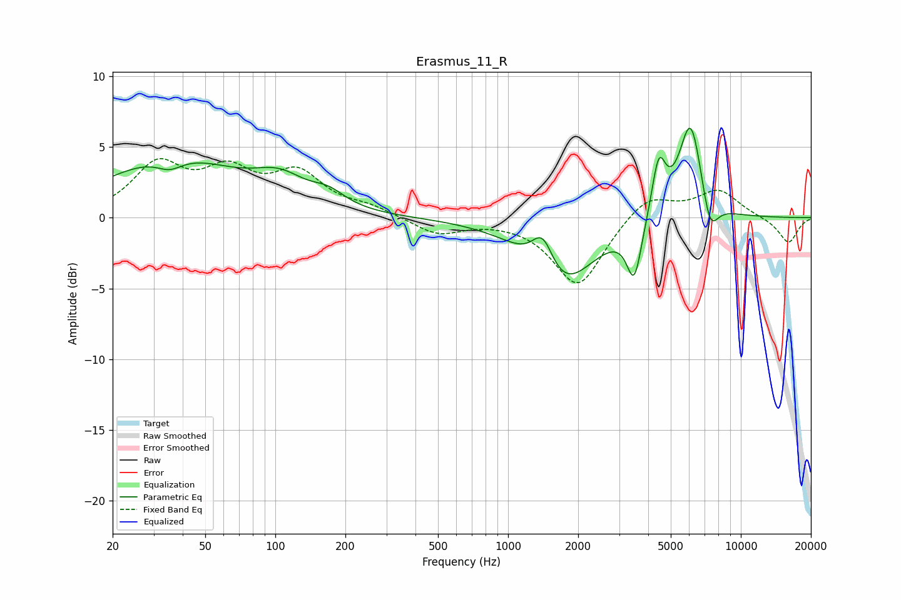

# Erasmus_11_R
See [usage instructions](https://github.com/jaakkopasanen/AutoEq#usage) for more options and info.

### Parametric EQs
Apply preamp of -6.4 dB when using parametric equalizer.

|   # | Type    |   Fc (Hz) |    Q |   Gain (dB) |
|-----|---------|-----------|------|-------------|
|   1 | Peaking |        35 | 2.51 |        -0.9 |
|   2 | Peaking |        36 | 0.5  |         4.1 |
|   3 | Peaking |       105 | 1.27 |         1.7 |
|   4 | Peaking |       169 | 1.98 |         0.9 |
|   5 | Peaking |      1410 | 2.92 |         2.9 |
|   6 | Peaking |      1676 | 1.02 |        -5   |
|   7 | Peaking |      3485 | 4.44 |        -3.9 |
|   8 | Peaking |      4439 | 4.62 |         4   |
|   9 | Peaking |      6090 | 2.67 |         7.1 |
|  10 | Peaking |      7352 | 3.77 |        -2.8 |

### Fixed Band EQs
When using fixed band (also called graphic) equalizer, apply preamp of **-4.3 dB** (if available) and set gains manually with these parameters.

|   # | Type    |   Fc (Hz) |    Q |   Gain (dB) |
|-----|---------|-----------|------|-------------|
|   1 | Peaking |        31 | 1.41 |         3.5 |
|   2 | Peaking |        62 | 1.41 |         2.8 |
|   3 | Peaking |       125 | 1.41 |         2.8 |
|   4 | Peaking |       250 | 1.41 |         0.6 |
|   5 | Peaking |       500 | 1.41 |        -1.2 |
|   6 | Peaking |      1000 | 1.41 |        -0.1 |
|   7 | Peaking |      2000 | 1.41 |        -4.9 |
|   8 | Peaking |      4000 | 1.41 |         1.7 |
|   9 | Peaking |      8000 | 1.41 |         1.9 |
|  10 | Peaking |     16000 | 1.41 |        -1.8 |

### Graphs

