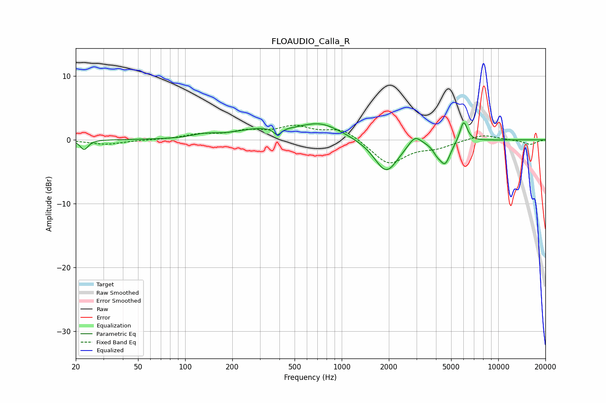

# FLOAUDIO_Calla_R
See [usage instructions](https://github.com/jaakkopasanen/AutoEq#usage) for more options and info.

### Parametric EQs
Apply preamp of -2.8 dB when using parametric equalizer.

|   # | Type    |   Fc (Hz) |    Q |   Gain (dB) |
|-----|---------|-----------|------|-------------|
|   1 | Peaking |        23 | 5.85 |        -1.5 |
|   2 | Peaking |       133 | 1.8  |         0.6 |
|   3 | Peaking |       296 | 0.89 |         1.4 |
|   4 | Peaking |       389 | 6    |        -1.1 |
|   5 | Peaking |       732 | 1.03 |         2.4 |
|   6 | Peaking |      1925 | 1.84 |        -5.2 |
|   7 | Peaking |      2932 | 3.46 |         1.7 |
|   8 | Peaking |      4053 | 5.6  |        -0.9 |
|   9 | Peaking |      4568 | 3.97 |        -3.5 |
|  10 | Peaking |      6009 | 5.79 |         3.3 |

### Fixed Band EQs
When using fixed band (also called graphic) equalizer, apply preamp of **-2.4 dB** (if available) and set gains manually with these parameters.

|   # | Type    |   Fc (Hz) |    Q |   Gain (dB) |
|-----|---------|-----------|------|-------------|
|   1 | Peaking |        31 | 1.41 |        -0.7 |
|   2 | Peaking |        62 | 1.41 |        -0   |
|   3 | Peaking |       125 | 1.41 |         0.7 |
|   4 | Peaking |       250 | 1.41 |         1.2 |
|   5 | Peaking |       500 | 1.41 |         1.9 |
|   6 | Peaking |      1000 | 1.41 |         1.8 |
|   7 | Peaking |      2000 | 1.41 |        -3.8 |
|   8 | Peaking |      4000 | 1.41 |        -1   |
|   9 | Peaking |      8000 | 1.41 |         0.9 |
|  10 | Peaking |     16000 | 1.41 |        -0.7 |

### Graphs

