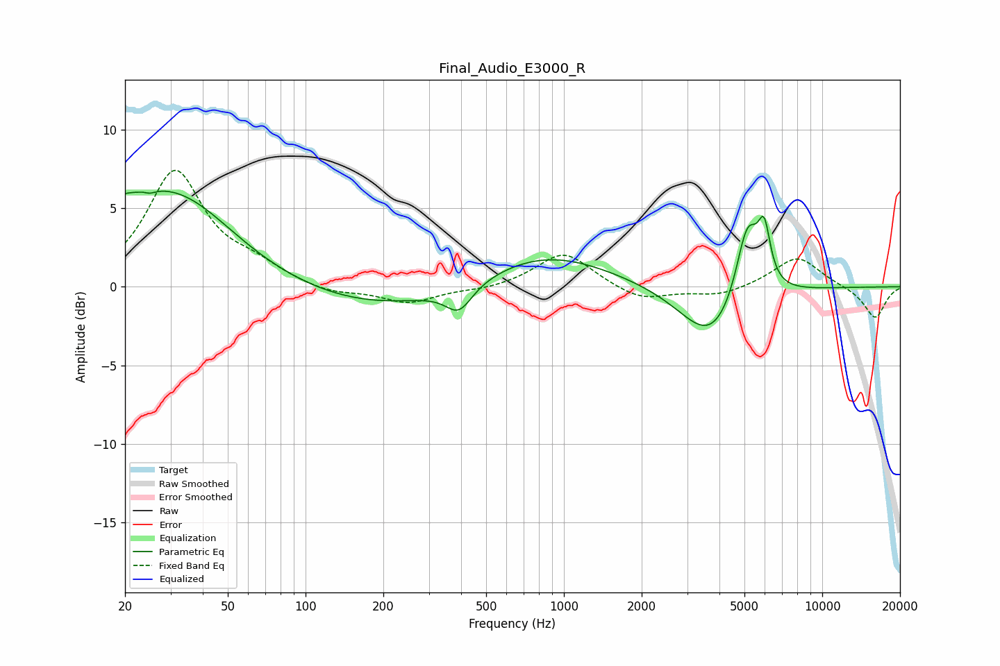

# Final_Audio_E3000_R
See [usage instructions](https://github.com/jaakkopasanen/AutoEq#usage) for more options and info.

### Parametric EQs
Apply preamp of -6.2 dB when using parametric equalizer.

|   # | Type    |   Fc (Hz) |    Q |   Gain (dB) |
|-----|---------|-----------|------|-------------|
|   1 | Peaking |        22 | 0.45 |         5.4 |
|   2 | Peaking |        24 | 5.98 |         2.8 |
|   3 | Peaking |        24 | 5.72 |        -3.1 |
|   4 | Peaking |        36 | 0.84 |         1.4 |
|   5 | Peaking |       201 | 0.4  |        -1.6 |
|   6 | Peaking |       393 | 2.73 |        -1.6 |
|   7 | Peaking |       823 | 0.55 |         2.3 |
|   8 | Peaking |      3732 | 1.16 |        -3.7 |
|   9 | Peaking |      5131 | 3.05 |         5.1 |
|  10 | Peaking |      5962 | 5.83 |         3.3 |

### Fixed Band EQs
When using fixed band (also called graphic) equalizer, apply preamp of **-7.5 dB** (if available) and set gains manually with these parameters.

|   # | Type    |   Fc (Hz) |    Q |   Gain (dB) |
|-----|---------|-----------|------|-------------|
|   1 | Peaking |        31 | 1.41 |         7.2 |
|   2 | Peaking |        62 | 1.41 |         1   |
|   3 | Peaking |       125 | 1.41 |        -0.5 |
|   4 | Peaking |       250 | 1.41 |        -1   |
|   5 | Peaking |       500 | 1.41 |        -0.2 |
|   6 | Peaking |      1000 | 1.41 |         2.2 |
|   7 | Peaking |      2000 | 1.41 |        -0.9 |
|   8 | Peaking |      4000 | 1.41 |        -0.6 |
|   9 | Peaking |      8000 | 1.41 |         2   |
|  10 | Peaking |     16000 | 1.41 |        -2   |

### Graphs

