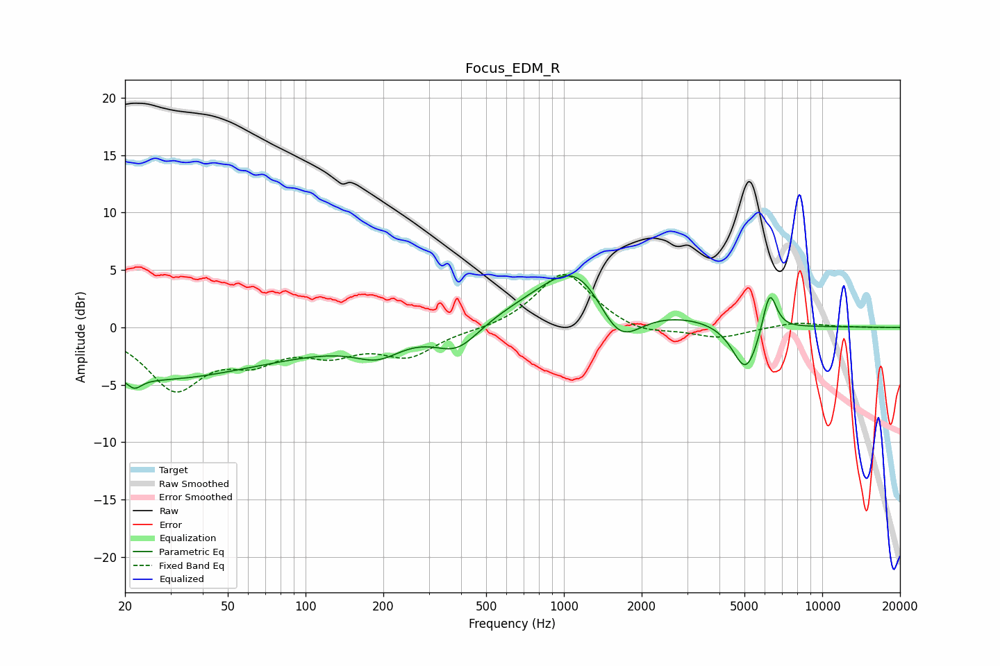

# Focus_EDM_R
See [usage instructions](https://github.com/jaakkopasanen/AutoEq#usage) for more options and info.

### Parametric EQs
Apply preamp of -4.6 dB when using parametric equalizer.

|   # | Type    |   Fc (Hz) |    Q |   Gain (dB) |
|-----|---------|-----------|------|-------------|
|   1 | Peaking |        22 | 5.1  |        -0.9 |
|   2 | Peaking |        23 | 0.4  |        -2.5 |
|   3 | Peaking |        63 | 0.18 |        -2.3 |
|   4 | Peaking |       191 | 1.56 |        -1.6 |
|   5 | Peaking |       387 | 1.58 |        -2.5 |
|   6 | Peaking |       734 | 0.18 |         1.7 |
|   7 | Peaking |      1155 | 1    |         5.2 |
|   8 | Peaking |      1619 | 1.53 |        -4.9 |
|   9 | Peaking |      5068 | 2.65 |        -4.5 |
|  10 | Peaking |      6251 | 4.96 |         3.9 |

### Fixed Band EQs
When using fixed band (also called graphic) equalizer, apply preamp of **-4.7 dB** (if available) and set gains manually with these parameters.

|   # | Type    |   Fc (Hz) |    Q |   Gain (dB) |
|-----|---------|-----------|------|-------------|
|   1 | Peaking |        31 | 1.41 |        -5.1 |
|   2 | Peaking |        62 | 1.41 |        -2.3 |
|   3 | Peaking |       125 | 1.41 |        -1.9 |
|   4 | Peaking |       250 | 1.41 |        -2.3 |
|   5 | Peaking |       500 | 1.41 |        -0.2 |
|   6 | Peaking |      1000 | 1.41 |         4.9 |
|   7 | Peaking |      2000 | 1.41 |        -0.7 |
|   8 | Peaking |      4000 | 1.41 |        -0.9 |
|   9 | Peaking |      8000 | 1.41 |         0.5 |
|  10 | Peaking |     16000 | 1.41 |        -0   |

### Graphs

