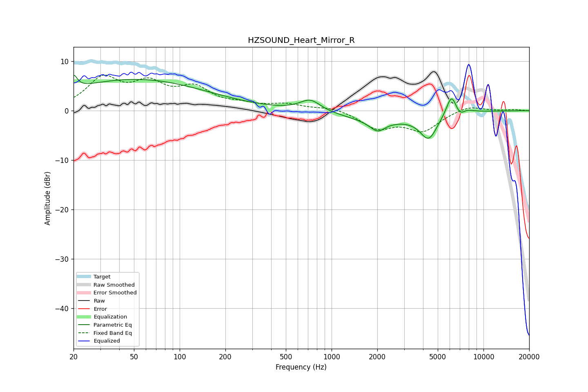

# HZSOUND_Heart_Mirror_R
See [usage instructions](https://github.com/jaakkopasanen/AutoEq#usage) for more options and info.

### Parametric EQs
Apply preamp of -7.3 dB when using parametric equalizer.

|   # | Type    |   Fc (Hz) |    Q |   Gain (dB) |
|-----|---------|-----------|------|-------------|
|   1 | Peaking |        20 | 5.97 |         2.8 |
|   2 | Peaking |        51 | 0.29 |         6.3 |
|   3 | Peaking |       724 | 2.1  |         2.3 |
|   4 | Peaking |      1835 | 2.8  |        -0.3 |
|   5 | Peaking |      2023 | 3.16 |        -1.8 |
|   6 | Peaking |      2065 | 0.64 |        -2   |
|   7 | Peaking |      4357 | 2.44 |        -5   |
|   8 | Peaking |      6165 | 3.97 |         4.5 |
|   9 | Peaking |      7108 | 3.01 |        -4.7 |
|  10 | Peaking |      7289 | 2.71 |         3.8 |

### Fixed Band EQs
When using fixed band (also called graphic) equalizer, apply preamp of **-7.3 dB** (if available) and set gains manually with these parameters.

|   # | Type    |   Fc (Hz) |    Q |   Gain (dB) |
|-----|---------|-----------|------|-------------|
|   1 | Peaking |        31 | 1.41 |         6.1 |
|   2 | Peaking |        62 | 1.41 |         4.7 |
|   3 | Peaking |       125 | 1.41 |         4.1 |
|   4 | Peaking |       250 | 1.41 |         1   |
|   5 | Peaking |       500 | 1.41 |         1.2 |
|   6 | Peaking |      1000 | 1.41 |         0.8 |
|   7 | Peaking |      2000 | 1.41 |        -3.4 |
|   8 | Peaking |      4000 | 1.41 |        -3.9 |
|   9 | Peaking |      8000 | 1.41 |         1.1 |
|  10 | Peaking |     16000 | 1.41 |         0.2 |

### Graphs

