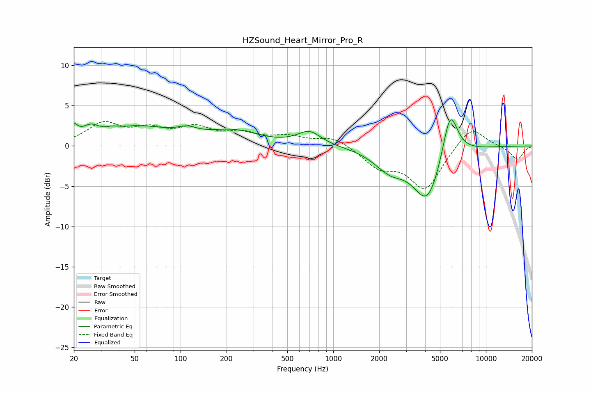

# HZSound_Heart_Mirror_Pro_R
See [usage instructions](https://github.com/jaakkopasanen/AutoEq#usage) for more options and info.

### Parametric EQs
Apply preamp of -3.3 dB when using parametric equalizer.

|   # | Type    |   Fc (Hz) |    Q |   Gain (dB) |
|-----|---------|-----------|------|-------------|
|   1 | Peaking |        20 | 5.87 |         1.5 |
|   2 | Peaking |        26 | 2.56 |         1.4 |
|   3 | Peaking |        36 | 4.35 |         0.3 |
|   4 | Peaking |        52 | 0.65 |         2.2 |
|   5 | Peaking |       111 | 2.22 |         0.8 |
|   6 | Peaking |       221 | 0.84 |         1.7 |
|   7 | Peaking |       696 | 1.85 |         1.7 |
|   8 | Peaking |      2349 | 1.37 |        -2.4 |
|   9 | Peaking |      4142 | 1.5  |        -6.7 |
|  10 | Peaking |      5823 | 2.73 |         6.3 |

### Fixed Band EQs
When using fixed band (also called graphic) equalizer, apply preamp of **-3.1 dB** (if available) and set gains manually with these parameters.

|   # | Type    |   Fc (Hz) |    Q |   Gain (dB) |
|-----|---------|-----------|------|-------------|
|   1 | Peaking |        31 | 1.41 |         2.6 |
|   2 | Peaking |        62 | 1.41 |         1.7 |
|   3 | Peaking |       125 | 1.41 |         2   |
|   4 | Peaking |       250 | 1.41 |         1.3 |
|   5 | Peaking |       500 | 1.41 |         1   |
|   6 | Peaking |      1000 | 1.41 |         1.2 |
|   7 | Peaking |      2000 | 1.41 |        -2.4 |
|   8 | Peaking |      4000 | 1.41 |        -5.3 |
|   9 | Peaking |      8000 | 1.41 |         2.7 |
|  10 | Peaking |     16000 | 1.41 |        -1.7 |

### Graphs

