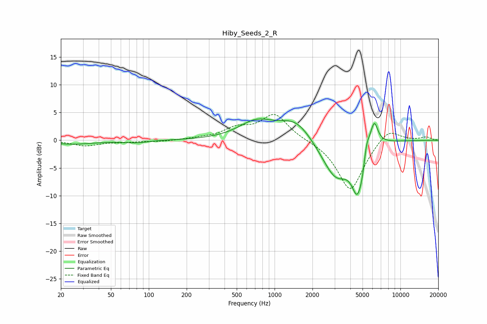

# Hiby_Seeds_2_R
See [usage instructions](https://github.com/jaakkopasanen/AutoEq#usage) for more options and info.

### Parametric EQs
Apply preamp of -3.9 dB when using parametric equalizer.

|   # | Type    |   Fc (Hz) |    Q |   Gain (dB) |
|-----|---------|-----------|------|-------------|
|   1 | Peaking |        25 | 0.78 |        -0.7 |
|   2 | Peaking |        79 | 1.62 |        -0.4 |
|   3 | Peaking |       716 | 1.01 |         3.1 |
|   4 | Peaking |      1482 | 1.07 |         3.7 |
|   5 | Peaking |      3066 | 1.21 |        -7.2 |
|   6 | Peaking |      4557 | 2.89 |        -8.8 |
|   7 | Peaking |      5023 | 5.96 |        -2.3 |
|   8 | Peaking |      5162 | 1.4  |         2.3 |
|   9 | Peaking |      5346 | 5.57 |         2.8 |
|  10 | Peaking |      6191 | 4.68 |         4.1 |

### Fixed Band EQs
When using fixed band (also called graphic) equalizer, apply preamp of **-4.7 dB** (if available) and set gains manually with these parameters.

|   # | Type    |   Fc (Hz) |    Q |   Gain (dB) |
|-----|---------|-----------|------|-------------|
|   1 | Peaking |        31 | 1.41 |        -1   |
|   2 | Peaking |        62 | 1.41 |        -0.3 |
|   3 | Peaking |       125 | 1.41 |        -0.2 |
|   4 | Peaking |       250 | 1.41 |         0.2 |
|   5 | Peaking |       500 | 1.41 |         1.9 |
|   6 | Peaking |      1000 | 1.41 |         4.6 |
|   7 | Peaking |      2000 | 1.41 |         0   |
|   8 | Peaking |      4000 | 1.41 |        -9.2 |
|   9 | Peaking |      8000 | 1.41 |         2.5 |
|  10 | Peaking |     16000 | 1.41 |         0.6 |

### Graphs

