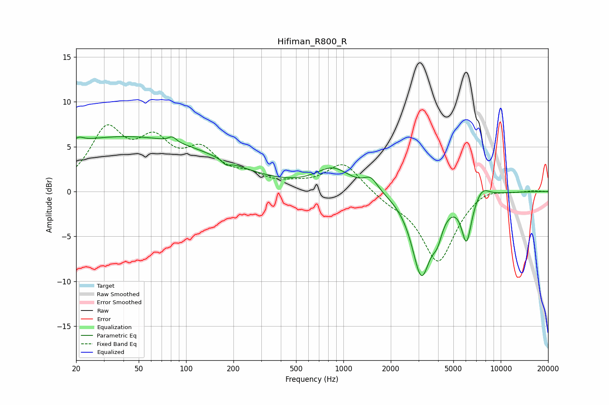

# Hifiman_R800_R
See [usage instructions](https://github.com/jaakkopasanen/AutoEq#usage) for more options and info.

### Parametric EQs
Apply preamp of -6.2 dB when using parametric equalizer.

|   # | Type    |   Fc (Hz) |    Q |   Gain (dB) |
|-----|---------|-----------|------|-------------|
|   1 | Peaking |        21 | 4.74 |         0.5 |
|   2 | Peaking |        41 | 0.21 |         6.1 |
|   3 | Peaking |        82 | 5.88 |         0.6 |
|   4 | Peaking |       180 | 6    |        -0.5 |
|   5 | Peaking |       861 | 1.28 |         2.4 |
|   6 | Peaking |      1493 | 3.25 |         1.4 |
|   7 | Peaking |      3131 | 2.3  |        -9.1 |
|   8 | Peaking |      3950 | 4.33 |        -2.1 |
|   9 | Peaking |      6061 | 4.36 |        -5   |
|  10 | Peaking |      7640 | 3.13 |         1.1 |

### Fixed Band EQs
When using fixed band (also called graphic) equalizer, apply preamp of **-7.5 dB** (if available) and set gains manually with these parameters.

|   # | Type    |   Fc (Hz) |    Q |   Gain (dB) |
|-----|---------|-----------|------|-------------|
|   1 | Peaking |        31 | 1.41 |         6.4 |
|   2 | Peaking |        62 | 1.41 |         4.6 |
|   3 | Peaking |       125 | 1.41 |         3.8 |
|   4 | Peaking |       250 | 1.41 |         1.3 |
|   5 | Peaking |       500 | 1.41 |         0.5 |
|   6 | Peaking |      1000 | 1.41 |         3.2 |
|   7 | Peaking |      2000 | 1.41 |        -0.9 |
|   8 | Peaking |      4000 | 1.41 |        -7.8 |
|   9 | Peaking |      8000 | 1.41 |         0.7 |
|  10 | Peaking |     16000 | 1.41 |         0.1 |

### Graphs

