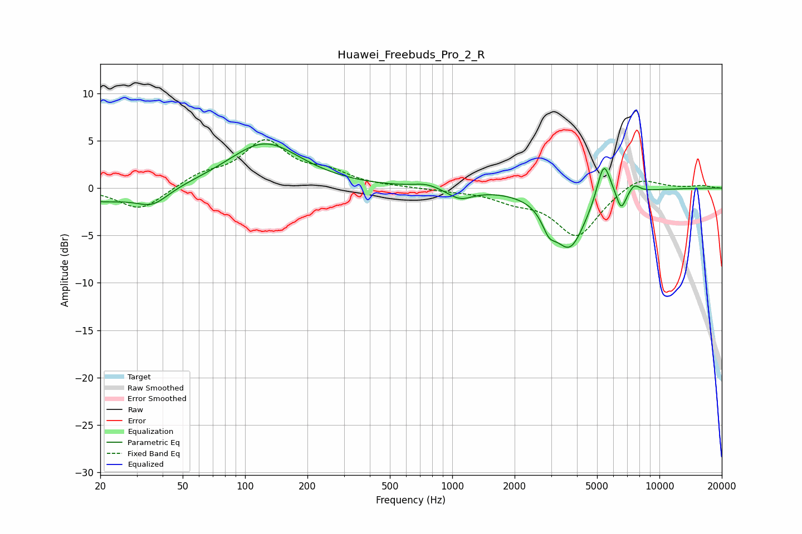

# Huawei_Freebuds_Pro_2_R
See [usage instructions](https://github.com/jaakkopasanen/AutoEq#usage) for more options and info.

### Parametric EQs
Apply preamp of -4.8 dB when using parametric equalizer.

|   # | Type    |   Fc (Hz) |    Q |   Gain (dB) |
|-----|---------|-----------|------|-------------|
|   1 | Peaking |        20 | 0.76 |        -1.4 |
|   2 | Peaking |        36 | 1.88 |        -1.6 |
|   3 | Peaking |       124 | 0.81 |         4.8 |
|   4 | Peaking |       754 | 2.25 |         0.5 |
|   5 | Peaking |      1091 | 2.31 |        -1.1 |
|   6 | Peaking |      2930 | 4.37 |        -1.8 |
|   7 | Peaking |      3688 | 1.78 |        -6.2 |
|   8 | Peaking |      5386 | 4.23 |         4.3 |
|   9 | Peaking |      6537 | 6    |        -2.1 |
|  10 | Peaking |      7565 | 5.33 |         0.8 |

### Fixed Band EQs
When using fixed band (also called graphic) equalizer, apply preamp of **-5.2 dB** (if available) and set gains manually with these parameters.

|   # | Type    |   Fc (Hz) |    Q |   Gain (dB) |
|-----|---------|-----------|------|-------------|
|   1 | Peaking |        31 | 1.41 |        -2.4 |
|   2 | Peaking |        62 | 1.41 |         1.3 |
|   3 | Peaking |       125 | 1.41 |         4.7 |
|   4 | Peaking |       250 | 1.41 |         1.4 |
|   5 | Peaking |       500 | 1.41 |         0.1 |
|   6 | Peaking |      1000 | 1.41 |        -0.2 |
|   7 | Peaking |      2000 | 1.41 |        -1.1 |
|   8 | Peaking |      4000 | 1.41 |        -5   |
|   9 | Peaking |      8000 | 1.41 |         1.4 |
|  10 | Peaking |     16000 | 1.41 |         0.3 |

### Graphs

