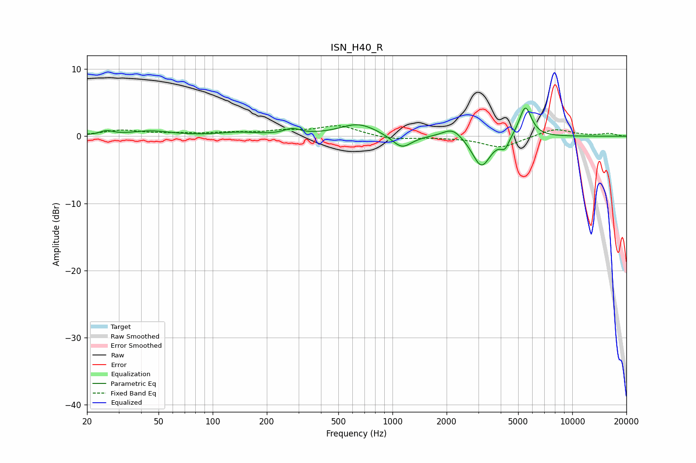

# ISN_H40_R
See [usage instructions](https://github.com/jaakkopasanen/AutoEq#usage) for more options and info.

### Parametric EQs
Apply preamp of -4.3 dB when using parametric equalizer.

|   # | Type    |   Fc (Hz) |    Q |   Gain (dB) |
|-----|---------|-----------|------|-------------|
|   1 | Peaking |        26 | 3.82 |         0.6 |
|   2 | Peaking |        45 | 1.3  |         0.7 |
|   3 | Peaking |       141 | 1.37 |         0.5 |
|   4 | Peaking |       276 | 3.13 |         0.8 |
|   5 | Peaking |       646 | 1.36 |         1.9 |
|   6 | Peaking |      1127 | 2.61 |        -2   |
|   7 | Peaking |      2161 | 2.56 |         1.6 |
|   8 | Peaking |      3123 | 2.78 |        -4.7 |
|   9 | Peaking |      4218 | 5.99 |        -1.6 |
|  10 | Peaking |      5480 | 4.1  |         4.6 |

### Fixed Band EQs
When using fixed band (also called graphic) equalizer, apply preamp of **-1.7 dB** (if available) and set gains manually with these parameters.

|   # | Type    |   Fc (Hz) |    Q |   Gain (dB) |
|-----|---------|-----------|------|-------------|
|   1 | Peaking |        31 | 1.41 |         0.8 |
|   2 | Peaking |        62 | 1.41 |         0.3 |
|   3 | Peaking |       125 | 1.41 |         0.4 |
|   4 | Peaking |       250 | 1.41 |         0.7 |
|   5 | Peaking |       500 | 1.41 |         1.5 |
|   6 | Peaking |      1000 | 1.41 |        -0.5 |
|   7 | Peaking |      2000 | 1.41 |        -0.1 |
|   8 | Peaking |      4000 | 1.41 |        -1.7 |
|   9 | Peaking |      8000 | 1.41 |         1.2 |
|  10 | Peaking |     16000 | 1.41 |         0.4 |

### Graphs

